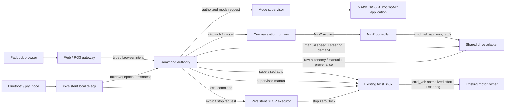
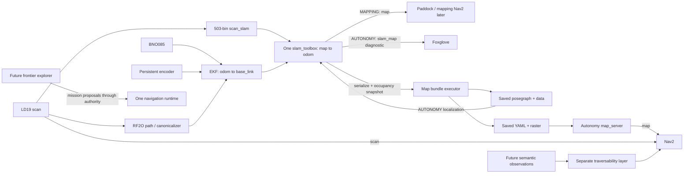

# Runner — Architecture & Current-State Specification v1.3

**Ratified implementation contract · 7 September 2026 · staged implementation required**

Baseline: `/home/matti/runner_ws`, clean HEAD `6a7c9611a3a910d93b607dcd8523707915f9fcaf`, inspected over authenticated SSH. Previous repository specification: `docs/runner_spec_v1.2.md`; synced project v1.2 also reviewed. Evidence was collected across 6–7 September, Europe/Copenhagen. This document specifies the target; it does not claim the target is implemented. Reconciled against unchanged HEAD on 7 September before installation. Target requirements are not claims of completed implementation.

**Reading convention.** “Current” means inspected source/runtime unless attributed to historical specification. “Required” incorporates Matti’s supplied direction. “Proposed” identifies target interfaces whose exact schemas may be refined from evidence. Matti ratified the policies in §18. Historical D-numbers are always qualified by source version and title/subject. No new D-number is allocated here.

## 1. Executive architecture summary

Paddock becomes the normal operator interface for runtime selection, manual driving, supervised autonomous missions, STOP, mapping sessions, map bundles, operational settings and useful health feedback. The browser requests intent; a persistent Pi-side command authority validates that intent and grants bounded motion permission. Neither browser nor authority can bypass actuator safety.

Runtime and motion authority are independent dimensions:

- Runtime: **IDLE / MAPPING / AUTONOMY** describes the active application.
- Normal motion authority: **STOP / IDLE / MANUAL / AUTONOMOUS** describes Paddock permission.
- Actual selected motion source is separately reported: **none / stop / local / paddock_manual / autonomous**. DualSense takeover is an independent local fact, not a fifth Paddock authority mode.

One existing `twist_mux` remains the final arbiter and sole `/cmd_vel` writer. Precedence is **STOP > DualSense > Paddock manual > authorized autonomy**. Inactive motion sources are silent. A selected zero is a real braking command. STOP is a latched global inhibit with explicit clear semantics, not an idle zero stream.

One navigation runtime owns all mission action clients. One existing drive-adapter conversion implementation serves bounded remote speed demand without retuning its frozen controller. Motor, encoder, serial and TF ownership stay unchanged. Local Bluetooth teleop and the same mux become persistent outside application launch lifetimes.

The current graph is transitional: the adapter and incomplete authority both write `/cmd_vel_auto`; authority has no action client; web is read-only; teleop/mux are application-owned; keyboard and Foxglove still own operational bypasses. These are migration inputs, not v1.3 behavior to preserve.

## 2. Retained platform and safety boundary

Runner remains the LaTrax Prerunner research platform: Pi 5, Ubuntu 24.04, ROS 2 Jazzy, LD19, BNO085, hall encoder and MD13S. The purpose and phase framing of v1.2 remain: Phase 1 navigation is the established platform; racing research has no imposed thesis deadline. This task adds the operator architecture, not racing control or new sensing.

The v1.2 hardware/estimation/control baseline remains binding except the explicit reconciliations in §16. Geometry remains wheelbase 0.178 m, maximum steering 0.3614 rad, physical minimum radius 0.470 m and planner radius 0.60 m. These are distinct quantities. No geometry, footprint, TF extrinsics, localization, Nav2 tuning or speed-envelope tuning is changed by this proposal.

| Resource / boundary | Retained owner and rule |
|---|---|
| Motor effort PWM, steering PWM, direction GPIO | Existing `motor_node` executable, runtime node `/motor_driver`; sole actuator owner; existing PWM setup service only establishes access |
| Encoder GPIO | Persistent `encoder_node`; existing freshness and reversal evidence contract |
| Motor watchdog | Existing `/cmd_vel` watchdog and zero-duty braking; no browser or supervisor replaces it |
| Direction/reversal | Existing motor-local gate; a negative demand means reverse, never brake; no upstream component owns permission to flip direction |
| Hard actuator limits | Motor-local bounds remain authoritative for every source |
| LD19 UART | LD19 process, application sensors tier; one owner of `/dev/ttyAMA0` |
| BNO085 UART/reset | Existing IMU process and chip-resolution conventions; one owner of `/dev/ttyAMA2` |
| `odom → base_link` | EKF only; RF2O remains an estimator input, not this TF owner |
| `map → odom` | Exactly one slam_toolbox instance, mapping or localization according to runtime |
| Static extrinsics | Existing static publishers only |
| `/map` | Mapping: slam_toolbox. Autonomy: map_server; localizer raster remains `/slam_map` |

TF is a multi-publisher transport with **single ownership per edge**, not a single-writer topic. Sensor ownership is checked before application transitions; duplicate node names alone are not proof of duplicate hardware owners. The live graph listed RF2O twice while process inspection showed one RF2O executable; no new TF fault is asserted from that observation.

Paddock STOP is a software motion inhibit, not proof of mechanical stationarity or independent power isolation. Preserve v1.2’s known motor SIGKILL/PWM-peripheral hazard and deferred heartbeat-gated FET decision; do not claim this architecture closes it. The planar scan cannot see descending edges or sufficiently low obstacles. Supervised exploration is permitted by the new direction without waiting for a negative-obstacle sensor; these existing operating-envelope limits remain visible.

## 3. Paddock-first operating model

Paddock supports deliberate operator functions through bounded named commands. Multiple clients may observe; exactly one server-issued control lease may mutate normal operational intent. A lease identifies a browser instance/session, not merely a username or socket. Reconnection does not restore grants.

The gateway handles authentication, browser transport, schema validation and state delivery. Authority handles leases, allowed transitions, grants, revocations and authorization of operational requests. Runtime, navigation and map/configuration executors perform authorized work and report actual results. A successful HTTP/WebSocket send is never reported as successful runtime start, map save or mission execution.

STOP requests from an authenticated authorized operator are accepted without possession of the current driving lease; clearing STOP requires the active control holder and the clear protocol. This is a proposed access refinement, not a DDS security deployment. Ordinary trusted ROS engineering access remains an administrative trust boundary; production launch topology must not expose alternate operator writers.

| Surface | Supported role |
|---|---|
| Paddock | Primary runtime, mapping, manual, mission, RUN/STOP, settings and health interface |
| DualSense | Independent local Bluetooth manual fallback and takeover; existing local effort shaping/fixed-throttle behavior retained |
| Foxglove | Diagnostic visualization, TF/topic inspection, plots and deeper engineering tools; any retained production goal convenience submits normal authorized intent |
| Laptop keyboard | Retired production authority and arming mechanism; optional engineering client only through the same authorization path |
| SSH/config files/arbitrary ROS parameters | Engineering/debug configuration; not the normal operator abstraction |

The first supported browser release must complete both “map the room and save it” and “select a map, select a real goal, hold RUN, release to stop.” A read-only observer alone is not this milestone. Detailed visual design, painted routes and map-mask editing need not precede it.

## 4. Orthogonal state models and transitions

### 4.1 Runtime/application

The runtime owner publishes requested state, actual state, phase (`STOPPING`, `STARTING`, `STABLE`, `FAULT`), runtime epoch, map/session identity and readiness reasons. A browser selection is only a request. IDLE means no managed mapping/localization/navigation application; persistent hardware and local control remain available.

| Actual runtime | Applications | Eligible remote motion | Local motion |
|---|---|---|---|
| IDLE | No mapping/Nav2 session | None | DualSense unless STOP/local safety inhibits |
| MAPPING | Sensors, estimation, fresh SLAM mapping session | MANUAL; AUTONOMOUS only once the separately gated exploration/Nav2 capability is installed and ready | Same local path |
| AUTONOMY | Sensors, estimation, slam_toolbox localization, map_server, Nav2, navigation runtime | MANUAL or supervised AUTONOMOUS | Same local path |
| Transition/fault | Truthful partial state; never falsely STABLE | No remote grants | Local path remains available unless explicit STOP is held |

Starting MAPPING from IDLE creates a new unsaved session; it does not implicitly deserialize the previously selected map. A repeated request for the already stable runtime is idempotent and does not reset a map. NEW MAP is an explicit operation within MAPPING. Selecting another localization map requires a stopped application transition and new epoch; it never hot-swaps the map under a moving mission.

Before an ownership-changing application transition, require explicit STOP and fresh measured stationarity. Reject with an actionable reason if not satisfied; do not silently add a second “maintenance arming” state. Stop old applications and verify owners are gone before starting replacements. Keep persistent local/mux and motor/encoder processes alive. Remain STOP after the transition until explicit clear. A fault does not automatically clear an existing STOP.

### 4.2 Normal motion authority

| State | Meaning | Command publication |
|---|---|---|
| STOP | Latched global inhibit; all normal grants revoked, local blocked | Dedicated stop enforcement; ordinary manual/auto outputs cease |
| IDLE | Default normal authority; no remote motion; local remains available | Both normal authority outputs silent |
| MANUAL | Paddock owns normal remote permission in MAPPING/AUTONOMY | Only fresh authorized manual conversion may be forwarded |
| AUTONOMOUS | Eligible for supervised mission operation | No output until dispatch/acceptance/execution/freshness/RUN gates all hold |

Startup with a known clear STOP record gives authority IDLE and no mission/grant. A persisted asserted STOP remains STOP. Unknown/corrupt STOP state is reported as a local inhibit fault, never treated as clear. Lease acquisition, selecting MANUAL or AUTONOMOUS, socket reconnection and mode readiness alone cannot move the car.

### 4.3 Transition contract

| Event | Immediate permission effect | Mission/result and rearm effect |
|---|---|---|
| STOP | Revoke all normal grants; assert global stop enforcement | Cancel in-flight action; invalidate resumable grant/mission generation. Stored mission may remain as a template, but requires explicit selection/validation and new RUN |
| CLEAR STOP | Keep outputs inhibited through acknowledged clear and source-neutral checks | Return normal authority to IDLE; never redispatch or replay. New manual engagement or AUTONOMOUS + mission + fresh RUN required |
| Enter MANUAL from autonomy | Revoke autonomy before allowing manual | Cancel action immediately/asynchronously; old mission cannot resume on manual release |
| Manual input release | Immediate zero transition if that source owned output, then silence | Return IDLE; no fallback to old autonomy |
| Manual staleness/lease loss | Same fail-closed behavior, invalidate manual grant | New lease/engagement required; held cached joystick cannot resume |
| Select AUTONOMOUS | No motion | Validate/select mission separately; wait for fresh RUN edge |
| RUN press | May authorize dispatch or re-dispatch | Only under current lease, ready runtime, current mission and neutral local input |
| RUN release | Revoke motion without waiting for Nav2 cancellation | Proposed initial policy: cancel action but retain logical mission and progress; next deliberate RUN may dispatch remaining work after cancellation/quiescence |
| DualSense engagement, even zero-speed engagement | Revoke all remote grants before local release/fallthrough | Cancel autonomy; require explicit Paddock rearm after local release; manual also requires a fresh engagement |
| Runtime/map/session change | Revoke grants and invalidate old epochs | No mission from the old map/session can resume |
| Readiness loss/process restart | Revoke remote grants | Remain visibly not ready; restoration does not rearm |
| Success/failure/cancel/supersession | Revoke current action grant | Terminal state persists as status, never as fresh motion |

“Deliberate RUN” means a fresh release-to-press sequence after the latest required rearm barrier, not an old `run_held=true` heartbeat. Finishing a mission while RUN is held cannot start a newly selected one. A route may advance within its already authorized logical mission while RUN remains continuously valid; replacing the mission requires a new grant.

## 5. Global STOP and inactivity

Required invariant: **an accepted STOP must not silently clear because its publisher dies, its input expires, a browser reconnects, or an application restarts.** Suppressing only Paddock outputs cannot stop DualSense. A high-priority expiring zero topic alone violates this invariant once it expires. A mux lock alone suppresses messages but does not itself command an immediate brake.

**Ratified packaging (§18-Q1):** a small persistent local STOP executor (`runner_stop_enforcer`) records and enforces the authority’s explicit stop state. It is not a mux, mission owner or arming policy. It cannot grant motion or clear STOP autonomously. It owns one highest-priority zero input to the existing mux, plus a fail-closed mux lock heartbeat and acknowledged stop status. Authority remains the sole normal policy writer. Exact priority proposal: autonomy 50, Paddock manual 75, DualSense 100, global lock 200, stop-zero input 255.

The executor persists asserted/cleared state with monotonic stop generation and acknowledges only the applied state. It publishes brake zeros while STOP is asserted; when clear it publishes **no velocity**, only the lock heartbeat/status. If the executor fails, its lock heartbeat expires and blocks all ordinary sources; the motor watchdog stops previously delivered motion. This is a visible local-control fault, not a silently cleared STOP. Fresh startup requires the executor to reconcile durable state before reporting healthy. Absence of Paddock authority or web does not make a known-clear executor assert STOP; local driving remains independent of those processes.

The stock mux lock masks priorities below the lock’s priority and treats an expired positive-timeout lock as locked. These mechanics are supported by the inspected twist_mux header; exact deployed QoS, startup behavior and timing must be verified during implementation. Stop input timeout remains finite; persistent enforcement comes from the local executor and lock, not immortal stored velocity. No added component writes `/cmd_vel`.

CLEAR STOP is a compare-and-apply request for the current stop generation. Require fresh local control status, released local dead-man/triggers and fresh measured stationarity. Invalidate normal grants and require a new local dead-man engagement after clear. Keep the lock asserted until the old stop velocity input and pre-clear source samples have aged out; acknowledge clear only after that barrier. Reordered/delayed clear cannot clear a newer STOP. If motion safety requires immediate assertion before disk I/O, inhibit first and complete the durable acknowledgement afterward; do not tell the browser “STOP applied” before enforcement is confirmed.

Escalation alternative only: changing the existing mux requires a report of concrete evidence that the ratified external executor cannot meet the contract. Do not implement that fork automatically. Neither option changes motor/PWM safety. A transient authority-only stop publisher is rejected.

Selected manual/autonomous zero commands may legitimately remain fresh while a fresh current grant exists. On ordinary release/revocation, send a bounded brake transition on that source and then become silent. Never use the global STOP topic for ordinary RUN release: doing so would incorrectly suppress valid local takeover and conflate inactivity with explicit STOP. State/status may continue at all times.

## 6. Command and data flows

The data diagram expresses runtime-conditional ownership, not simultaneous `/map` writers. MAPPING exploration uses the mapping raster and existing SLAM TF; it must not start the autonomy localizer/map_server composite. Semantic costs do not mutate geometric occupancy or own motion authority.

## 7. Exact proposed interface ownership

Names and new types below are **v1.3 proposals**, not claims of installed interfaces. “Persistent” means independent of application units; “application” means under the mode supervisor. One gateway is the sole ROS writer even with many connected browsers. Status consumers include the Paddock cache and engineering tools in addition to those shown.

| Current topic/interface | Proposed topic/interface | Semantic/type | Sole writer → consumer | Lifetime | Class |
|---|---|---|---|---|---|
| `/paddock/control_event` | same, revised typed schema | Session/lease/sequence, runtime and grant epochs; RUN, mode, manual, real mission and settings intents | Web gateway → authority | Persistent | Raw intent |
| `/paddock/control_lease` | same, revised schema | Server lease ID, owner, expiry, generation | Authority → executors/gateway | Persistent | Status/grant |
| `/paddock/command_authority_state` | same | Requested authority, actual grants, inhibit/rearm reasons, freshness, epochs | Authority → gateway/adapter/navigation | Persistent | Status/grant |
| `/paddock/mode_request` | same, correlated schema | Authorized mode/map operation, bounded request validity | Authority → mode supervisor | Persistent | Authorized request |
| `/paddock/mode_state` | same, expanded | Actual mode/phase, runtime epoch, readiness, map/session | Mode supervisor → authority/executors | Persistent | Status |
| No production typed input | `/paddock/manual_demand` | Signed speed m/s, normalized steering, validity and generation | Authority → drive_adapter | Persistent | Bounded intent |
| `/cmd_vel_nav` | same | Existing SI Twist, linear.x m/s and angular.z rad/s | `controller_server` → drive_adapter | Application | Raw controller output |
| Adapter currently writes `/cmd_vel_auto` | `/cmd_vel_auto_raw` | Proposed typed converted command: effort, steering, upstream sample/age, producer/runtime/action/grant IDs | `drive_adapter` → authority | Persistent process; active only for eligible application | Raw converted command |
| No manual converter | `/cmd_vel_paddock_manual_raw` | Same converted-command schema, manual demand sequence/expiry | Same `drive_adapter` → authority | Persistent | Raw converted command |
| `/cmd_vel_auto` has two writers | `/cmd_vel_auto` | Normalized compatibility Twist; only currently supervised autonomy | Authority → existing mux | Persistent writer, silent inactive | Supervised command |
| `/cmd_vel_paddock` not in current mux | same | Normalized compatibility Twist; only supervised manual | Authority → existing mux | Persistent writer, silent inactive | Supervised command |
| None | `/paddock/stop_request` | Assert/clear with stop generation and correlation | Authority → STOP executor | Persistent | Authorized inhibit request |
| None | `/paddock/stop_state` | Durable applied stop state, generation, health, clear barrier | STOP executor → authority/local/gateway | Persistent | Status |
| None | `/paddock/stop_lock` | Bool heartbeat to fail-closed lock; true on stop | STOP executor → mux | Persistent | Local inhibit |
| None | `/cmd_vel_stop` | All-zero compatibility Twist only while explicit STOP | STOP executor → mux | Persistent, silent clear | Stop command |
| `/joy` | same | Existing Joy input | `joy_node` → local teleop | Persistent | Local input |
| `/teleop/active_mode` | `/teleop/control_state` | Typed active/inactive, connectivity, sample age, process/takeover epoch, neutral/release status | `runner_teleop` → authority/adapter/STOP executor | Persistent | Status |
| `/cmd_vel_teleop` | same | Existing local normalized effort/steering, fresh engagement only; bounded release brake | `runner_teleop` → mux | Persistent | Local command |
| `/cmd_vel` | same | Normalized effort linear.x, normalized steering angular.z; remaining fields zero | Existing `twist_mux` → motor and conversion observer | Persistent | Final command |
| Direct Foxglove/keyboard goal inputs | `/paddock/navigation_request` | Authorized select/dispatch/cancel; real map-frame mission and generations | Authority → navigation runtime | Persistent publisher | Authorized mission request |
| `/runner/autonomy_state` | `/paddock/navigation_state` | Typed real mission/action lifecycle, UUID, generation, result | Navigation runtime → authority/gateway | Application; absence is stale | Status |
| `/move_base_simple/goal`, `/runner/waypoint`, `/runner/route_control` | Retired production ingress; gateway intent replaces them | No direct action bypass; diagnostic clients use same normal intent/lease | No production writers/consumers after cutover | Removed | Legacy intent |
| `/runner/route`, `/runner/route_markers`, `/runner/waypoint_queue`, `/runner/waypoint_queue_markers` | Retain visualization names where currently provided | Mission/route previews, not authorization | Navigation runtime → Paddock/Foxglove | Application | Status/data |
| Nav2 `NavigateToPose`, `NavigateThroughPoses` actions | Same action names/types | One client owner for all normal missions; Nav2 server owns response/status endpoints | Navigation runtime client ↔ bt_navigator | Application | Execution interface |
| None | `/paddock/map_request` | Authorized NEW/RESET/SAVE with session/name/request identity | Authority → map-session executor | Persistent | Authorized operation |
| None | `/paddock/map_state` | Session/save progress, bundle catalog/revision, failure | Map-session executor → authority/gateway/mode supervisor | Persistent | Status |
| SLAM reset/serialize and map saver CLI | Existing services / export capability | Map executor sole production caller; SLAM remains state owner | Map executor → SLAM/map export | MAPPING | Operation interface |
| None | `/paddock/config_request` | Named bounded setting transaction, expected revision | Authority → operational-config executor | Persistent | Authorized operation |
| None | `/paddock/config_state` | Requested/applied/observed values and per-field result | Operational-config executor → authority/gateway | Persistent | Status |
| `/initialpose` engineering publishers | Same topic, controlled production ingress | PoseWithCovarianceStamped, map frame, realistic covariance, stopped-only | Map/localization executor → slam_toolbox | Persistent writer, eligible runtime only | Authorized pose intent |
| `/teleop/keyboard_state` | Removed from production | No keyboard latch/control input to adapter, bridge or teleop | None | Removed | Legacy control |
| `/teleop/fixed_throttle_setpoint` | same | Local normalized effort setpoint, never browser speed ceiling | `runner_teleop` → diagnostics | Persistent | Status |
| `/drive_adapter/state`, `/drive_adapter/state_typed` | Retain; extend typed status with demand source/epoch | Actual conversion, clamp and integrator-freeze reason | `drive_adapter` → gateway/diagnostics | Persistent | Status |
| `/speed_envelope/status` | same | Origin/live divergence; observer is not authority | Speed-envelope observer → diagnostics/config executor | Persistent or active when controlled nodes exist | Status |
| `/motor/direction` | same | Existing motor direction status, unchanged consumer restrictions | Motor → existing approved consumers | Persistent | Local state |
| `/wheel/encoder_state`, `/wheel/odom` | same | Existing encoder state/odometry | Encoder → motor/adapter/EKF as currently appropriate | Persistent | Sensor/state |

ROS-generated parameter-event, logging and action transport topics are intentionally multi-endpoint infrastructure, not new single-writer motion channels. Navigation runtime may own more than one action client object; the invariant is **one mission execution component**, not one action type. Nav2 internal action clients remain internal to Nav2. No recovery/behavior node may gain a second `/cmd_vel_nav` or `/cmd_vel` writer in this scope.

New raw command schemas explicitly separate normalized effort from SI speed. They carry finite values, producer boot identity, upstream sequence, runtime/map-session/action/grant generation and a Pi-monotonic validity deadline. Command QoS is volatile, bounded/latest-only; status may be transient-local but carries a boot ID and freshness age. ROS wall/sim time is not the lease clock. Consumer validation rejects malformed, obsolete, expired, reordered and wrong-source records.

## 8. Process lifetime and responsibility

**Persistent hardware tier, unchanged:** PWM setup, motor, encoder, battery/telemetry and their current safety conventions. Paddock gets no privilege to start/stop hardware services.

**Persistent local-control tier, proposed:** one joy process, local teleop, the existing mux and STOP executor. Application launch files stop constructing these nodes. Web, authority, mode or Nav2 failure cannot remove local control when STOP is known clear. Local-controller disconnection is a reported inactive source; loss of local supervision state is a different fault and revokes remote grants.

**Persistent operator tier:** gateway, command authority, mode supervisor, map/configuration execution capabilities and shared drive adapter. These may share noncritical execution packaging where useful, but blocking map save, service calls, disk writes and systemd transitions must never block the authority’s expiry/output path. Map executor requests process replacement through the mode supervisor; it never becomes a second process-lifecycle owner. Use the existing narrowly scoped matti polkit/D-Bus model rather than broad sudo or wildcard service privileges.

**Application tier:** sensors and estimation retain their current application lifetime; no new persistent estimation tier is required for local effort-based DualSense. MAPPING starts mapping SLAM. AUTONOMY starts localization, map_server, Nav2 and the single navigation runtime. The persistent adapter observes fresh feedback when remote operation is eligible and stays silent otherwise. Future mapping navigation is a separate gated application composition within MAPPING.

Authority owns permission, not PI calculation, map serialization, systemd or Nav2 action implementation. Mux owns final priority selection, not leases, missions or browser timeouts. Motor owns hard actuator safety, not operator mission policy. All gate decisions publish reasons; a Boolean “armed” cannot conceal several unrelated prerequisites.

Existing direct launch commands become engineering-only entry points with explicit persistent-tier prerequisites. An externally launched live graph is not adopted automatically: report ownership conflict and require controlled teardown before a managed start. Current runtime demonstrated why: PID 11378 ran `autonomy.launch.py map_name:=studio` while both managed application units were inactive.

## 9. Paddock manual speed control and conversion reuse

Manual input is `{signed_speed_mps, steering_normalized}`. Positive speed is forward, negative reverse, zero active braking. Steering is front-wheel steering demand in [-1,1], normalized by the retained maximum steering angle; positive follows the existing positive steering convention. It is not yaw rate. Steering-at-zero is a supported manual command while manual engagement remains fresh. Browser joystick scaling may be normalized internally, but the transmitted semantic demand and displayed applied value use m/s.

Initial remote manual ceiling proposal is **0.30 m/s**, preserving v1.2’s phone ceiling. Ceiling controls can reduce the usable range; increasing this established phone bound requires a separately approved envelope decision. Autonomy retains the current maximum commanded speed of 0.60 m/s and desired speed default 0.45 m/s. No higher-performance tuning is smuggled into interface work.

Keep the frozen zero-or-minimum-moving-speed contract: exactly zero or magnitude at least 0.25 m/s. For a positive effective ceiling below 0.25, reject the configuration; ceiling zero means disabled motion. For a nonzero demand below 0.25 with a sufficient ceiling, promote to 0.25 and report the applied value. Apply floor and ceiling coherently: floor promotion must never exceed an operator ceiling. The operator must not be shown a fictitious 0.10 m/s crawl. Mapping remote manual ceiling is additionally bounded by its 0.30 m/s default. These remote speed ceilings do not retune the deliberately independent DualSense effort path; display its local semantics separately.

**Proposed refinement:** extend the existing drive adapter to service exactly one authority-selected remote demand at a time. Autonomy supplies existing SI `/cmd_vel_nav`; manual supplies authority-bounded speed plus direct steering. Use one longitudinal controller state and the same calibrated conversion implementation/configuration origin. This demand selection implements an already decided normal grant; it is not a second priority arbiter. Final local/STOP precedence stays solely in the existing mux.

Retain feedforward 0.1188·|v| + 0.0174, Kp 0.05, Ki 0.01, integrator ±0.005 and output magnitude cap 0.14. Preserve magnitude-domain error, sign, existing conditional integration and freeze/hold behavior. No extra PI, hidden tuning, integrator preload or direction gate. Preserve integrator state across direction/source changes; freeze while not selected and invalidate stale demand/history as required without inventing a new reset of the frozen integral. A fresh demand is required at handoff; old autonomy samples cannot become manual demand or vice versa.

Current direction feedback reaches the adapter through `EncoderState.pending_direction`, populated from motor direction; the adapter does not directly subscribe to `/motor/direction`. Preserve that existing path and its meaning. Current autonomy steering correctly uses `yaw_rate / speed` with signed speed. Its zero-speed branch brakes and does not preserve manual steering; therefore feeding fake yaw rate into the unmodified autonomy interface is not a correct manual implementation. Reuse longitudinal conversion while supplying steering through an honest source-specific boundary.

Replace legacy `/teleop/active_mode` assumptions with current grant and local takeover status. Preserve final-output comparison as the existing conservative integrator feedback, additionally requiring a current matching grant and fresh inactive local state. Unknown/preempted arbitration freezes integration, not permission-independent motion. Equal numerical commands do not prove source identity; do not advertise comparison-derived status as exact mux selection. Exact mux source telemetry is optional instrumentation of the existing arbiter if later needed, not permission to add a second mux. Feedforward output while the integral is frozen avoids a circular “must already be selected before producing the first command” gate.

## 10. Real navigation mission lifecycle

Refactor the useful queue/route/action behavior of `foxglove_goal_bridge.py` into one `runner_navigation_runtime`; retire its direct goal and keyboard ingress atomically. Preserve cancellation retries and delayed callback protection, but do not copy optimistic authority-state scaffolding as action truth.

A logical mission contains an immutable mission ID/revision, type (single goal or ordered poses initially), real finite map-frame poses with valid orientations, map bundle or mapping-session identity, runtime epoch, progress and provenance. Validate pose/schema/frame/map identity before selection; planner success and reachability are established later. Placeholder (0,0,0) is prohibited unless that is the operator’s actual validated goal.

| State | Evidence and allowed next step |
|---|---|
| NO_MISSION | No current validated mission; cannot dispatch |
| SELECTED_VALIDATED | Real mission bound to current map; wait for RUN/readiness |
| DISPATCH_REQUESTED | Current authority request sent; no motion yet |
| NAV2_ACCEPTED | Actual accepted action handle/UUID; wait for executing state and fresh originating output |
| EXECUTING | Current action reports execution through real action status/feedback; motion still requires all continuous grants |
| CANCEL_REQUESTED | Gate already closed; wait for terminal/quiescent action result |
| CANCELLED | Actual action cancellation completed; retained logical mission may be offered for deliberate continuation according to revocation reason |
| SUCCEEDED | Real success result; no residual grant |
| FAILED | Rejection/abort/timeout/error with explicit detail; no automatic retry that moves without current grant |
| SUPERSEDED | Old logical revision invalidated; delayed callbacks cannot authorize its replacement |

Dispatch requires current selected mission + current fresh RUN + lease + runtime/readiness + no STOP/takeover/rearm block. It does **not** require an already active action or fresh command. Motion additionally requires accepted/executing current action + fresh source command + matching conversion provenance. This separates authorization to ask Nav2 to work from authorization to move.

On RUN release, cancel the action but preserve logical mission/progress as a deliberate-continuation candidate. This is the recommended first-release policy because Nav2 may otherwise time out while the vehicle is gated stationary. A next RUN can re-dispatch uncompleted work only after cancellation/quiescence and validation. STOP, runtime/map change and manual takeover require stronger explicit re-selection/rearm; releasing takeover never resumes anything. Cancel timeout keeps motion revoked and replacement blocked; report it for operator recovery. Successful cancel request acknowledgement is not terminal cancellation.

Use separate identities for boot/session, runtime/map session, logical mission revision, action attempt and motion grant. Every asynchronous callback validates the relevant identities and actual goal handle. Navigation-runtime crash/restart revokes permission and reconciles or cancels residual server goals before accepting a new dispatch. Do not “adopt” an old accepted action as newly authorized.

**Unstamped Nav2 boundary:** current Twist contains no mission identity. Attaching the newest mission ID to whatever arrives is unsafe. The navigation executor and converter must implement a quiescence barrier: close grants, cancel prior action, await terminal execution, stop/drain prior command delivery, invalidate cached converter input, then begin a fresh action attempt and accept only samples admitted after that barrier. Bound transport queues/age and observe a quiet interval covering their configured bound. If that bound cannot be established, keep cutover blocked and escalate an explicitly stamped controller-boundary change; do not invent provenance. The initial implementation acceptance must inject/deliver an old delayed sample across cancellation and show zero authorized stale output.

Planning/dispatch/cancel operations have bounded operation timeouts and visible progress; these are distinct from short continuous motion freshness. A slow valid plan produces a waiting state, never an optimistic “executing.”

## 11. Browser lease, RUN and freshness

A single server lease owns normal mutations. Fresh ordered browser messages renew it only for the actual participating browser instance. RUN and manual input have their own current value/sequence and age within that lease: a generic heartbeat cannot indefinitely preserve a held RUN or joystick that the browser stopped sampling. Releasing pointer capture, tab visibility changes and explicit release should send immediate release, but Pi-side expiry remains authoritative.

A web worker must never manufacture renewals from cached browser values. Queue depth and sequence alone do not establish freshness after TCP stalls. Proposed protocol: short-lived Pi-issued renewal challenge, echoed by fresh browser input with monotonically increasing sequence; authority checks challenge expiry using its monotonic clock. Reject replay, old challenge, duplicate sequence and wrong lease/session. Bound gateway queues to latest input and never flush a backlog as fresh motion. Browser timestamps are diagnostic unless a verified clock-age contract is implemented.

Converted commands preserve upstream receipt/sample identity and original expiry; a 20 Hz conversion timer must not extend an old controller or browser input. The authority checks raw transport age **and** originating input age, current grant/action/runtime epochs, readiness age and local takeover epoch. Mode state and action state have explicit validity windows; transient-local cached data is not automatically current.

Exact production browser timeout remains implementation-informed. Current values are evidence, not a new safety claim: authority defaults to 150 ms lease/raw receipt timeouts at 100 Hz supervision; adapter Nav2 timeout is 250 ms at 20 Hz; mux auto/local timeouts are 300/150 ms; motor watchdog threshold is 200 ms and it checks every 50 ms. These serial stages do not constitute a 150 ms end-to-end stop guarantee.

Before activating motion, document and measure an end-to-end budget with: browser input expiry, authority scheduling/delivery, upstream command validity, mux input/lock expiry, motor watchdog/check period and margin. Report maximum observed stale nonzero `/cmd_vel` duration, not just average publish rate. Physical stopping distance remains Matti’s hardware validation.

For a functioning authority, revocation-to-zero is bounded by its scheduling/output budget. For authority death, no timer elsewhere may replay its command; remaining nonzero delivery and motor watchdog define the fallback bound. For STOP-executor death, lock expiry plus motor watchdog defines the bound. Local takeover revocation must complete **before** local input expiry could allow remote fallthrough. If local telemetry is lost, remote grants close before that bound; an independently guessed 200 ms authority-local timeout against a 150 ms local mux timeout is unacceptable. Persist a takeover counter across individual status updates so a short local engagement cannot be missed.

## 12. Minimal readiness and truthful status

Readiness is capability-specific. It is continuously refreshed, not only checked during mode startup. A present process is one observation, not “ready to drive.” Do not build a general validation framework.

| Capability | Minimum evidence |
|---|---|
| Persistent local control | Expected joy/teleop/mux/hardware owners; known STOP state and fresh local enforcement; live local input or explicitly disconnected status |
| Paddock manual | Stable eligible runtime; fresh lease/manual engagement; local takeover state; valid conversion configuration and fresh encoder/required motion feedback; functioning mux/motor boundary; no STOP |
| Mapping operational | One mapping SLAM active/configured as applicable; fresh `/scan_slam`, estimation input and usable TF; map/session identity; first current-session processed map evidence |
| Nav2 dispatch | Stable eligible runtime, valid map/session, required Nav2 lifecycle nodes ACTIVE, action servers available, usable fresh pose/TF and required scan/odometry; no ownership conflict |
| Autonomous motion | Dispatch prerequisites plus real accepted/executing current action, fresh raw/controller input, current RUN/grant and no cancellation/takeover |
| Save map | Current session has map content; stopped/inhibited; exporter/serialize service available; destination valid and writable; no reset/save already in flight |

Freshness thresholds are tied to observed producer behavior. Mapping raster configuration updates at 5 s; demanding 150 ms raster freshness would be false failure. A static map is immutable identity data and need not repeatedly publish; validate its contents/identity and map_server lifecycle instead. TF availability is not evidence localization is accurate; display uncertainty/fault evidence without making a generic quality certification claim.

Count publisher endpoints/GIDs as well as names for single-writer command topics. Check TF ownership per edge, serial/hardware per owner and application exclusivity. Do not collapse duplicate same-name endpoints into a set that hides a conflict. Never authorize motion simply because a expected-name process is present.

The browser displays actual runtime/phase, requested authority, granted/selected source (or explicitly inferred/unknown), STOP applied/pending/fault, lease owner/age, RUN held/rearm requirement, mission/action progress, map identity, requested/applied settings and the first actionable inhibit reason. Long map save and mode transition work stays off the command timer. Configuration observer timeout remains “unknown,” not a fabricated healthy value.

## 13. Mapping sessions and complete map bundles

### 13.1 NEW MAP / RESET MAP SESSION

Entering MAPPING creates a fresh unsaved session. NEW MAP while already mapping deliberately replaces the current unsaved session, with an explicit discard confirmation naming that session when data would be lost. No saved bundle is deleted. Require STOP and measured stationarity; cancel exploration if present and invalidate old navigation/map/session identities before reset.

**Proposed implementation:** mode supervisor replaces the mapping SLAM process using existing mapping configuration with no `map_file_name`. It verifies the old instance has exited before starting the same owner role anew. Sensors/EKF and persistent local control need not restart. Reset Paddock raster/pose/mission caches and allocate a new session epoch. Do not report ready until current-session scan/TF/map evidence arrives; a retained old raster is not a new map.

Installed slam_toolbox is 2.8.5 and exposes `Reset.srv`, including `pause_new_measurements`. Its reset callback resets mapper and scan solver and sets first-measurement handling; it does not establish a Runner-wide cache/session reset. A fresh process is the recommended clean-session boundary, not a literal buffer clear. The reset service is a possible later optimization after proving complete session equivalence. See [slam_toolbox 2.8.5 reset implementation](https://github.com/SteveMacenski/slam_toolbox/blob/2.8.5/src/slam_toolbox_common.cpp#L1031). No live reset was called in this task.

### 13.2 SAVE MAP

Operator supplies a basename. Accept the existing bounded safe name convention (letter/number first, letters/numbers/dot/underscore/hyphen, no `..`, path separators or escape from map root); impose a documented finite length. Existing basename/artifacts cause rejection, never overwrite. Correlate operation to current session and request ID; retries are idempotent.

Require STOP/stationarity for the initial save workflow. Quiesce new SLAM measurements and in-flight map mutation; capture a consistent posegraph and corresponding occupancy snapshot from that session. Keep readiness explicitly saving/paused. Because pause is toggle-based, the executor must track/observe actual pause state and never retry a blind toggle. Generate/obtain a fresh occupancy snapshot after quiescence rather than saving an arbitrary old transient raster.

A complete localization bundle requires nonempty **`.posegraph`, `.data`, `.yaml` and the occupancy image referenced by YAML** (currently `.pgm`). Serialization success alone and four filenames alone are insufficient. Verify result code, file sizes, YAML parse/image path, raster dimensions/resolution/origin/frame consistency and session association. Add a manifest/commit marker containing session ID, creation time, calibration/configuration identity and hashes of the four core artifacts. This metadata augments the current loader; it does not replace the posegraph localization architecture.

Use a staging basename/directory outside the selectable catalog. Only expose a completed bundle after all validation and the final manifest/catalog transaction. Preserve incomplete output for diagnosis/recovery but never list it as selectable. Serialize and occupancy export errors identify the failed stage; do not announce “saved” on a service response that created no files. Existing `scripts/save_map.sh` already checks serialize type/result and nonempty core artifacts; reuse its proven contract while adding consistent-session and publication semantics.

After save, retain the current mapping session and its saved revision; return to paused/STOP with explicit resume/clear, not automatic driving. The operator may later enter AUTONOMY with the saved bundle. Acceptance includes one isolated deserialize/load smoke check of a saved bundle with endpoint exclusivity and matching raster metadata—needed to catch silent unusable serialization, not a route-validation campaign.

### 13.3 Normal workflow

Enter STOP while stationary → select MAPPING → observe new session ready → clear STOP → engage Paddock manual or DualSense → release to stop → STOP → SAVE MAP with name → see completed bundle and identity → select AUTONOMY/map while stopped if desired → clear STOP → select real mission → select AUTONOMOUS → hold RUN.

Foxglove is optional throughout. Basic map view/status belongs in Paddock; detailed scan/TF inspection remains engineering tooling.

## 14. Supported operator configuration

A typed allowlist separates supported settings from arbitrary ROS parameters. Authority authorizes the transaction; one configuration executor validates and applies it outside the control loop, reads actual values back and publishes the result. The committed speed-envelope file remains the baseline origin. Operational overrides have an explicit revision and source and are reported separately from baseline divergence. Do not rewrite calibration files on each browser slider change.

| Supported field/action | Proposed bounds / semantics | Apply rule |
|---|---|---|
| `manual_max_speed_mps` | 0 (disabled) or [0.25, 0.30] initially | Session operational setting; authoritative manual clamp |
| `mapping_speed_ceiling_mps` | 0 or [0.25, 0.30]; effective remote ceiling is min with manual ceiling | Applies to remote mapping demand; no implied DualSense retuning |
| `autonomy_desired_speed_mps` | Initial [0.30, 0.60], default 0.45; respects current RPP 0.30 regulation floor and 0.25 approach floor | Apply/read back named RPP setting while stopped; no controller lifecycle transition |
| `autonomy_speed_ceiling_mps` | 0 or [0.30, 0.60]; desired ≤ ceiling | Authority/conversion demand bound; no expansion of frozen maximum |
| `selected_map` | Complete verified catalog bundle ID/revision | No active-runtime hot swap; stopped runtime transition |
| NEW MAP / SAVE MAP | Named session operations, not parameters | §13 |
| `global_obstacle_layer_enabled` | Boolean, default true for obstacle-aware AUTONOMY; existing overwrite semantics unchanged | Named dynamic parameter, stopped apply + readback; display known low-obstacle limitation |
| Local obstacle-layer status | Read-only in first release; retains current enabled/marking/clearing configuration | Exposing disable requires explicit operational-envelope decision |
| Initial pose | Finite map-frame pose and valid covariance | STOP/stationary, current map, new localization-readiness check; no TF writer change |
| Goal/route/queue operations | Validated real poses, bounded supported mission types and finite queue size | Navigation runtime through authority |
| Future exploration start/stop | Capability-disabled until exploration stage passes | Same mission/RUN model |

Accepted settings survive ordinary lease loss as applied configuration, but never preserve motion grants. Initial proposal: speed/layer overrides are session-scoped and reset to reported committed defaults on a new runtime epoch; selecting a default map may be persisted without auto-launch or auto-RUN. Defaults, current request, applied value and observed value must all be distinguishable.

Nonfinite, out-of-range, stale-revision or unknown-field writes are rejected with a field-level reason. For multi-field requests, validate cross-field bounds before any apply; if a partial downstream apply fails, remain stopped, read back reality and report partial failure rather than falsely claiming atomic ROS parameter writes across nodes. Do not apply disruptive lifecycle transitions to make a setting “take.” If the desired RPP setting is not live-effective in the installed version, report and defer to a stopped relaunch path explicitly owned by the mode supervisor.

PI/feedforward, integrator bounds, output limits, geometry, encoder thresholds, reversal, motor watchdog, scan/localization parameters and Nav2 planner/controller tuning are engineering-only. Historical Foxglove live-gain controls are not automatically promoted to normal Paddock settings. The frozen controller is retained.

## 15. Future exploration and semantic traversability

Supervised frontier exploration is a future **MAPPING + AUTONOMOUS** capability. Explorer consumes geometric map/state and generates mission proposals above the single navigation runtime. Authority admits those proposals only for the selected exploration session; continuous browser RUN and all normal downstream gates still apply. Manual takeover, STOP, stale input and cancellation use the same semantics. There is no exploration velocity topic or special motor path.

A later application composition adds Nav2 using the live mapping raster and existing mapping `map → odom`. It must not reuse `nav2.launch.py` wholesale if that also starts localization/map_server. This is a future ownership-reviewed stage, not implemented by the first operator cutover. No negative-obstacle sensor is a prerequisite for its first supervised version under the ratified direction.

Semantic terrain/traversability is a separate map-frame layer with class, confidence, timestamp, source and map/session identity. Asphalt, trail, grass, hardwood, carpet and other classes may influence route costs and frontier utility. Unknown/low-confidence semantics remain explicit. Geometric SLAM occupancy must not be repurposed to encode terrain class. Semantic layers neither authorize motion nor replace STOP; authority remains independent of planner preferences. v1.2’s categorical claim that no addable sensor can resolve pavement/gravel boundaries is superseded by this camera-classification direction, not treated as a physical impossibility.

## 16. Decision and specification reconciliation

Unchanged historical material remains reference evidence; v1.3’s target clauses govern the operator architecture after ratification. Do not rewrite history or reuse an unqualified D-number.

| Source version + decision title/section | Disposition for v1.3 |
|---|---|
| v1.2 §1, “Runner is explicitly not the thesis vehicle” (D-87) | Retain purpose, discipline and phase framing |
| v1.2 “Persistent motor hardware ownership” (§4.2, D-71) and persistent encoder (§4.6/§5, D-75 references) | Retain hardware services; extend application completeness rule to assume persistent local-control tier |
| v1.2 “Runnable launch completeness” (D-29 as amended in §4.2) | Amend local teleop/mux lifetime; standalone application launches must not duplicate persistent owners |
| v1.2 §4.4 ownership and §4.12 “Fixed SLAM scan cardinality” (D-37) | Retain per-edge TF, serial, canonicalization and `/scan_slam` mapping path; qualify `/map` owner by runtime |
| v1.2 §4.15 “Drive adapter” (D-55) | Amend direct normalized adapter→mux path into raw→authority→supervised path; retain units conversion and steering saturation behavior |
| v1.2 “MD13S plant characterized; longitudinal controller frozen” (D-84) | Retain all calibration/freeze behavior; reuse one longitudinal state for remote manual/autonomy; update arbitration inputs without tuning |
| v1.2 “Reverse autonomy” (D-85) | Retain Reeds-Shepp/RPP reverse and downstream reversal ownership. §4.4’s broad motor-direction consumer wording must be read with §4.15’s permitted adapter feedback; do not give RPP actuator subscriptions |
| v1.2 “Speed envelope single committed origin and detected divergence” (D-86) | Retain; add explicit supported operational override/readback semantics, not arbitrary parameter editor |
| v1.2 §5 “Brake semantics / reversal gate” (D-73/D-74 subjects) | Retain zero brake, signed reverse, motor watchdog and gate unchanged |
| v1.2 “Unified throttle semantics” (D-83) | Retain deliberate DualSense local shaping/fixed setpoint. Browser speed demand is a separate semantic interface |
| v1.0 “Keyboard autonomy is a 600 s Pi-side latch” (D-71) | Supersede for production; no browser-independent keyboard latch or arming bypass |
| v1.2 §7.9 “Why teleop bypasses drive adapter” | Narrow to local DualSense effort path; does not apply to new browser speed-demand manual control |
| v1.2 §9.1–9.4 Paddock modes, single-process diagram, systemd targets/sudo proposal | Replace with orthogonal states, persistent separate authority, current polkit/D-Bus mode owner and bounded execution capabilities. Current units are two application services, not the old proposed target hierarchy |
| v1.2 §9.3 “Stop is default / joystick suppresses stop” | Replace with default authority IDLE + inactive silence, explicit globally latched STOP; retain fail-closed browser freshness |
| v1.2 §9.3 ~150 ms and §9.4 “Autonomous supervision is interrupt” / full ceiling | Replace with continuous supervised RUN and measured end-to-end expiry budget; no universal timeout ratification or unattended latch |
| v1.2 §9.2 `{v,w}` joystick and §9.3 normalized client | Clarify transmitted signed m/s + normalized steering, applied floor/ceilings and source identity |
| v1.2 §9.2 static raster never changes | Applies to saved AUTONOMY map only; MAPPING raster changes with current session |
| v1.2 §9.5 map bundle/offline tooling (§8.5, D-80 subject) | Implement complete bundle semantics for normal mapping; offline fusion/editor remains future work |
| v1.2 §7.7 “Keepout filter and semantic layers” (D-79 subject), §3.2 terrain assertion | Retain occupancy/semantic separation and operating-envelope concerns; extend to future camera-derived terrain costs; no occupancy-value class encoding |
| v1.2 power/SIGKILL “Heartbeat-gated FET; software guardian rejected” (D-82 subject) | Retain; STOP executor controls existing mux only and does not claim to solve hard-killed PWM ownership |
| v1.2 §9.7 Paddock build order | Supersede with gated ownership/authority cutover below |
| Prior `architecture/RECOMMENDATION.md` local-over-STOP recommendation and separate manual adapter | Supersede precedence with ratified global STOP; recommend shared controller instead of competing PI instances |

Specific documentation corrections established now:

- `docs/map_saving.md` and `docs/global_costmap_obstacles.md` say no usable bundle is committed; HEAD tracks `studio.posegraph`, `.data`, `.yaml`, `.pgm`. Current launch uses `studio`. This establishes committed artifacts, not a newly repeated localization-quality certification.
- `services/README.md` describes authority as not connected to production mux; source/runtime show its `/cmd_vel_auto` publisher sharing the adapter’s mux input.
- v1.2 §4.15’s signed reverse-steering defect candidate is resolved in inspected source: `requested_curvature = yaw_rate / speed`. No hardware reverse-tracking conclusion is inferred from that line alone.
- v1.2 §9 readiness intent already asks for lifecycle and data age. Current mode supervisor implements a weaker check; v1.3 closes that implementation gap instead of inventing a new broad framework.
- v1.2 authority/mode wording and the staged reducer conflate some eligibility rules. Current manual selection only in MAPPING is superseded by MAPPING and AUTONOMY eligibility.

Ratified amendments are recorded in docs/decision_v1.3_paddock_first.md, qualified by version and title without allocating ambiguous historical numbers: “Paddock-first orthogonal runtime and motion authority”; “Global persistent STOP and local control lifetime”; “Supervised RUN, mission generations and cancellation”; “Single-writer raw/supervised conversion with shared remote speed controller”; “Supported operational configuration and complete mapping sessions.” These amend only the identified subjects, not all historical entries sharing their numbers.

## 17. Gated migration plan

Each row is a stage, not one oversized executor brief. Split implementation stages into one logical change per brief, with concrete acceptance and explicit ownership authorization. No production activation while an earlier gate remains open. Staging must be private, non-mux and, for parallel mission development, action-server-isolated. Do not exercise new raw commands against the live motor during offline work.

| Stage | Ownership/change | Acceptance gate | Required quantitative silent-failure check | Decision amendment |
|---|---|---|---|---|
| 0. Ratify contract | No runtime changes; settle §18, exact schemas and expiry budget | Approved state/ownership/failure table and scoped briefs | Table has one owner per command and no dispatch circularity | New v1.3 entries above |
| 1. Isolate unfinished authority | Move its scaffold outputs to private non-mux topics; leave existing adapter production input temporarily sole writer | Existing graph starts; no Paddock claim of production control | Endpoint count exactly one on every live mux velocity input; confirm private outputs have no production mux subscriber | Transitional staging + service-doc correction |
| 2. Build authority/local/STOP contracts privately | Typed browser input, epochs, truthful grants, local takeover counter, durable STOP executor/lock contract | Release/rearm/STOP restart behavior matches tables before persistent cutover | Replay/stale/browser-freeze rejection; STOP remains asserted across executor/authority restarts; takeover invalidation bound precedes mux fallthrough | Global STOP + lease semantics |
| 3. Persistent local-control cutover | Move exactly one joy/teleop/existing mux/STOP executor set out of application launches; disable ordinary autonomy during transition | Local driving available in runtime IDLE and through application/web/authority absence; STOP wins | Endpoint counts through both runtime transitions; zero inactive local stream; no nonzero final output during STOP; stale-lock behavior and no old-grant fallthrough | Lifetime/launch-completeness amendment |
| 4. Truthful runtime and map execution | Nonblocking mode operations, fresh readiness, complete NEW/SAVE workflow, supported settings executor | MAPPING session reset/save and AUTONOMY bundle selection work while stopped | Old owners gone before replacements; no stale raster/session accepted; file/manifest consistency and one deserialize smoke check; parameter requested/applied/readback equality | Map sessions/config/readiness |
| 5. Real navigation runtime privately | Refactor sole action-owner behavior in isolated environment; production old owner not run beside it | Real selection→dispatch→acceptance→execution→terminal and cancellation | Late callbacks/results and delayed old Twist cannot reopen grants; cancel timeout blocks replacement | Mission lifecycle amendment |
| 6. Remote manual conversion | Shared drive-adapter normal-demand contract; activate manual-only authority/mux input; production autonomy remains disabled | Browser speed/steering semantics work in MAPPING and AUTONOMY; local override/release/STOP correct | ±speed sign, zero/floor/ceiling and normalized units; one PI state; frozen parameter identity; max stale-command duration measured | Shared conversion/operator bounds |
| 7. Atomic autonomy cutover | Adapter sole raw-auto writer; authority sole supervised-auto writer; navigation runtime sole production mission client; retire direct Foxglove/keyboard latch and adapter legacy dependencies together | Real Paddock goal + held RUN produces flow; release/takeover stops; no resumption without required rearm | Exact endpoint ownership; 20 Hz conversion under valid input; delayed old samples rejected; web/authority/runtime/action loss bounds; no nonzero outside current grant | Raw/supervised seam + legacy supersession |
| 8. Complete browser/operator parity | Full supported settings, status, map/mission workflow; remove residual production legacy clients | Day-to-day workflows need neither keyboard nor Foxglove; unsupported settings explicit | No-op setting/save detection and stale state rendering; published requested/applied identities agree | Paddock role/build-order amendment |
| 9. Later supervised exploration | Add mapping Nav2 composition and explorer as mission proposer; same control path | MAPPING + AUTONOMOUS only with continuous RUN and live map | No second map/TF/cmd writer; takeover/release/old-session rejection with explorer | Separate future capability decision |

A minimal browser control client must exist before stage 6 acceptance; do not postpone all browser-originated liveness verification until stage 8. Development may proceed privately earlier, but production ownership switches occur only at the gated stages. STOP/local silence and takeover invalidation must land coherently; removing local zeros alone can expose old lower-priority autonomy. Retire action/latch bypasses in the same stage as the new action owner, not afterward.

Rollback is a stopped, explicit ownership transaction. Never restore legacy writer/arming paths while new supervised writers remain live. Capture old/new endpoint tables and effective config identity. If rollback restores the temporary legacy architecture, label it as such and keep unfinished authority isolated; do not advertise it as compliant v1.3.

Validation remains proportional: build/start/topic/finite-values smoke checks plus the specifically listed silent-failure measurements. Matti owns physical handling and stopping-distance validation. No parameter sweeps, broad harness or new route-validation campaign is requested by this spec.

## 18. Ratified policies and evidence gates

Matti ratified these decisions in the implementation brief on 7 September 2026:

1. **Q1 — Global persistent STOP.** Use a persistent local executor with the existing mux lock/zero facilities. Unknown or failed enforcement fails closed; known-clear enforcement remains independent of web/authority. Stop and report concrete installed-behavior evidence before changing the mux itself.
2. **Q2 — RUN release lifecycle.** Revoke motion immediately, cancel the current Nav2 action asynchronously, retain logical mission/progress as a continuation candidate, and require deliberate future RUN after cancellation/quiescence. Stronger takeover/STOP/runtime/session barriers remain binding. No fake action pause.
3. **Q3 — Initial operator bounds.** Manual maximum and mapping remote ceiling 0.30 m/s; autonomy desired default 0.45 m/s and maximum 0.60 m/s; existing minimum-moving speed 0.25 m/s. Keep feedforward, PI, integrator and output bounds frozen. Operational overrides are session/runtime-scoped unless explicitly specified otherwise.

Engineering evidence gates remain mandatory: measured timeout/queue budgets, installed mux lock behavior, STOP acknowledgement/restart ordering, Nav2 command quiescence/provenance, consistent map export and new-session invalidation. An unsafe unstamped boundary, incompatible STOP packaging, changed final mux/motor/encoder/TF/serial ownership, another mux or mission owner, retuning, or a localization change requires escalation before implementation past that fork.

The gated implementation brief governs stage acceptance and ordering. Backend completion precedes optional full frontend work. Traction remains physically disconnected; software validation does not establish physical driving performance.
