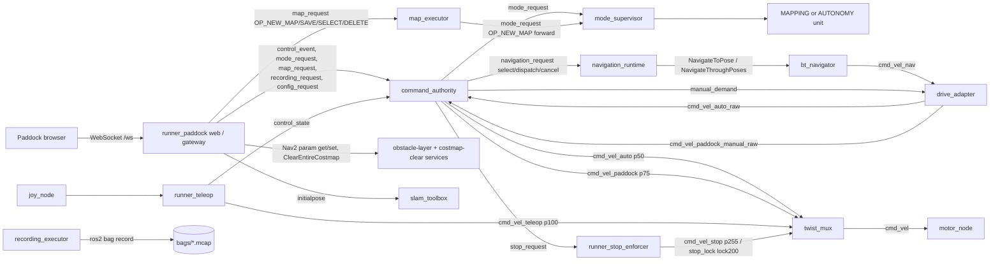

# Runner — Architecture & Current-State Specification v1.5

**Current-state specification · 12 September 2026**

Baseline: `/home/matti/runner_ws`, clean HEAD
`4366b5252058da8d665c1c5b0b15e22e7ed8760a` ("Preserve Paddock runtime
directory on restart"), inspected directly from source, tests, configuration,
systemd units, and (for the CPU/performance findings in §17) recorded
telemetry. Previous specification: `docs/runner_spec_v1.4.md` (ratified 12
September 2026 against baseline `044b4fb5`, corrected the same day at
`266966b`), reconciled here against six further commits landed after that
final v1.4 correction: `6388ee7` (SVG operator-interface icon, cosmetic),
`a484be4` (remove obsolete keyboard bridge), `4dfd572` (gate Paddock state
serialization by revision), `e6802d6` (stream Paddock small state by
section), `15aab09` (avoid process inspection during mode readiness
refresh), and `4366b52` (preserve Paddock runtime directory on restart).

This round is narrower in scope than the v1.3→v1.4 jump: it is a
CPU/performance investigation, two Paddock streaming mechanisms, a
mode-supervisor readiness optimization, and one runtime-directory lifecycle
bug fix — not a re-architecture. §1–§16 restate v1.4's architecture as
current, with in-place updates only where source/config actually changed;
§17 is new and carries the substantive investigation findings; §18–§21
update the open-items list, decision reconciliation, and historical appendix.

**Reading convention** (unchanged from v1.4). This document states what is
implemented in source and covered by tests as **current**, distinguishes
what is deployed but not yet hardware-validated or time-bounded as
**provisional/open**, and reserves **future** for capability that does not
exist yet. Historical D-numbers are always qualified by source version and
subject; **no new D-number is allocated by this document** — the six
commits reconciled here are implementation/optimization/bugfix work, not new
architectural decisions. Where current code or a decision Matti has ratified
supersedes an older numeric limit or claim, this document states the current
value and does not carry the old one forward as if still binding.
**Deploy coherence is not assumed**: this document describes the repository
at HEAD, not necessarily the code the Pi's systemd units are currently
executing (§15, §18).

## 1. Executive architecture summary

Paddock (`runner_paddock`, served by `runner-paddock-web.service` on
`0.0.0.0:8000`) is the delivered primary operator interface for runtime
selection, manual driving, supervised autonomous missions, STOP, mapping
sessions, complete map bundles (including deletion), live autonomy speed
tuning, obstacle-layer control, MCAP recording, and initial-pose seeding. The
browser holds at most one control lease; a persistent Pi-side command
authority (`runner_command_authority`) validates every intent against
continuously refreshed interlocks and grants bounded motion permission.
Neither the browser nor the authority can reach the actuator directly.

Runtime and motion authority remain independent dimensions:

- **Runtime** (`ModeState.mode`): `IDLE / MAPPING / AUTONOMY`, with a
  separate lifecycle `STATUS_STABLE / STATUS_TRANSITIONING / STATUS_FAULT`,
  a monotonic `runtime_epoch`, a `mapping_session_id`, and continuously
  refreshed `ready` / `readiness_reason`.
- **Motion authority** (`CommandAuthorityState.authority`):
  `AUTHORITY_NONE / AUTHORITY_DUALSENSE / AUTHORITY_PADDOCK_MANUAL /
  AUTHORITY_PADDOCK_AUTONOMY`, derived purely from lease, mode, DualSense
  presence, RUN, and goal state — never asserted independently of them
  (`runner_paddock/state_machine.py:112-124`).

One `twist_mux` remains the final arbiter and sole `/cmd_vel` writer, with
priorities **STOP (255/lock 200) > DualSense teleop (100) > Paddock manual
(75) > Paddock autonomy (50)**
(`src/runner_bringup/config/twist_mux.yaml`). Inactive sources are silent; a
selected zero is a real braking command; STOP is a latched, durably
persisted global inhibit with explicit clear semantics.

Reverse autonomy, obstacle-aware costmaps, a 7-state mission lifecycle, live
speed-policy tuning (Timid/Confident/Custom), complete map bundle lifecycle
(new/save/select/delete), MCAP recording, and a field Wi-Fi AP remain real,
tested, current behavior — not proposals. None of this changed in this
round. What did change since v1.4 is operational headroom and one lifecycle
correctness bug, not the control architecture:

- A **CPU/performance investigation** (§17.1) found sustained Pi CPU
  saturation during held-RUN Confident-preset autonomy, correlated with
  Nav2 command-stream starvation. Removing the obsolete `keyboard_bridge`
  process (`a484be4`) eliminated an independently measured ~17%-of-one-core
  idle workload that had been running continuously regardless of mode. The
  investigation also profiled Paddock's web process and the mode
  supervisor's readiness loop for further CPU wins; both were measured and
  **neither's leading hypothesis turned out to be the dominant CPU cost**
  (§17.2, §17.3) — though the changes made along the way are protocol-
  efficiency and readiness-scope improvements kept on their own merits, not
  CPU fixes.
- **Paddock's small-state streaming** was reworked (`4dfd572`, `e6802d6`,
  §17.2) to gate serialization by semantic revision and to push
  per-section updates instead of a repeated full-state frame — a streaming/
  protocol-efficiency and state-isolation improvement over the prior
  always-re-encode-everything behavior, not a fix to a functionally
  incorrect protocol. Both are real, tested, current behavior — CPU
  measurement before/after showed no material reduction in Paddock's own
  process cost.
- **`mode_supervisor`'s steady-state readiness refresh** (`15aab09`, §17.3)
  stopped enumerating `cgroup.procs`/`/proc/<pid>/cmdline` on every 0.5 s
  readiness tick, keeping that enumeration only for the cleanup/
  replacement/blocker-diagnostic path that actually needs process-level
  evidence. This also produced no measurable CPU reduction for the process
  itself (still roughly ~30% of one core); temporary instrumentation
  instead identified synchronous systemd/D-Bus unit inspection as the
  dominant **wall-time** cost inside the readiness callback — a distinct
  finding from CPU attribution (§17.3) — and an open optimization target,
  not a redesign this document proposes.
- A **map-pointer lifecycle bug** was root-caused and fixed (`4366b52`,
  §17.4): `RuntimeDirectoryPreserve=restart` was added to
  `runner-mode-supervisor.service` so a supervisor-only restart no longer
  deletes the `/run/runner-paddock` directory that holds the AUTONOMY
  map-selection pointer out from under a healthy `runner-mode-autonomy`
  unit.

The known open items, updated from v1.4 in §18, include: end-to-end
stale-command timing is still not formally budgeted; the 0.5 s motion
deadman is still a deployed but provisional value; sustained high-speed
AUTONOMY + recording performance still needs a fresh validation recording
after the CPU cleanup; Paddock web's ~40% one-core cost remains
unattributed, and mode_supervisor's ~30%-of-one-core cost remains
unattributed even though its readiness callback's dominant *wall-time*
component (synchronous systemd inspection) is now identified — both are
still-open optimization targets; a supervisor-only restart smoke test of
the `4366b52` fix may remain pending; and Pi deploy coherence must be
reverified after any change (`services/install.sh --check`, §15).

## 2. Platform, geometry, hardware and safety boundaries

Runner is the LaTrax Prerunner research platform: Raspberry Pi 5, Ubuntu
24.04, ROS 2 Jazzy, LD19 lidar, BNO085 IMU, hall-effect wheel encoder, and a
Cytron MD13S motor driver. Phase 1 (indoor/outdoor navigation) remains the
established platform focus; this document does not change platform purpose.

Geometry is unchanged from v1.2–v1.4: wheelbase 0.178 m, maximum steering
0.3614 rad, physical minimum turning radius 0.470 m. The planner's minimum
turning radius is **0.60 m**
(`src/runner_bringup/config/nav2_params.yaml:28`, `SmacPlannerHybrid.
minimum_turning_radius`) — a planning-time conservatism margin over the
physical minimum, not a claim that the vehicle cannot turn tighter.

| Resource / boundary | Current owner and rule |
|---|---|
| Motor effort PWM (GPIO12, 20 kHz), steering PWM (GPIO13, 50 Hz), direction GPIO23 | `runner-motor.service`, sole continuous owner, `pinctrl-rp1` GPIO chip by label; writes sysfs directly, never unexports either PWM channel |
| Encoder GPIO22 | `runner-encoder.service`, sole continuous owner; `/wheel/encoder_state` feeds the motor reversal gate and every consumer's stationarity/direction evidence |
| Motor watchdog | 200 ms `/cmd_vel` staleness → zero duty (active brake), checked every 50 ms; unchanged, no supervisor or browser component replaces it |
| Direction/reversal gate | Motor-local; a negative demand means reverse, never brake; requires a fresh post-request stationary encoder sample before flipping DIR; no upstream component owns this permission |
| LD19 UART (`/dev/ttyAMA0`) | LD19 driver process, application sensor tier |
| BNO085 UART/reset (`/dev/ttyAMA2`) | IMU process, application sensor tier |
| `odom → base_link` | `ekf_node` only; RF2O (`/odom_rf2o`) is an EKF input, never this TF owner |
| `map → odom` | Exactly one `slam_toolbox` instance: mapping SLAM in MAPPING, localization SLAM (remapped `/slam_map`) in AUTONOMY |
| Static extrinsics | Existing static TF publishers (`base_link_to_base_laser`, `base_link_to_imu_link`) |
| `/map` | MAPPING: `slam_toolbox`. AUTONOMY: `map_server`. Enforced per-topic by `runner_mode_supervisor._ownership_ready` (`mode_supervisor_node.py:225-245`), not by node-name counting |
| `/cmd_vel` | `twist_mux`, sole writer, unchanged |

TF is a multi-publisher transport with **single ownership per edge**, not a
single-writer topic; the mode supervisor checks publisher-owner sets per
critical topic/edge every readiness cycle and ignores endpoints whose node
identity has not yet propagated through DDS discovery
(`mode_supervisor_node.py:211-223`, carrying forward v1.3 §12's ruling that a
duplicate node *name* is not proof of a duplicate owner).

Retained hard safety limitations, unchanged by anything in this document:

- The planar LD19 scan cannot see descending edges or low obstacles;
  supervised autonomous/manual driving is not gated on a negative-obstacle
  sensor.
- Paddock/global STOP is a software motion inhibit, not proof of mechanical
  stationarity or independent power isolation.
- The known motor SIGKILL/PWM-peripheral hazard and deferred
  heartbeat-gated-FET decision (v1.2 subject, historically discussed as
  D-82) remain open; nothing in this architecture claims to close them.
  `runner_stop_enforcer` controls the existing mux/lock only.

One platform-level fact newly confirmed during the CPU investigation (§17.1)
belongs here: this Pi runs with `arm_freq=2800` in
`/boot/firmware/config.txt` and a live-measured core clock of **2.8 GHz**
(`vcgencmd measure_clock arm`) — above the Pi 5's 2.4 GHz stock clock. This
is host boot configuration, not a repository-tracked file, and this
document does not claim it was newly applied by any commit in this round;
it is recorded here because §17.1's CPU findings should be read against
this ceiling, not against a stock-clocked Pi 5, and because raising the
clock alone did not resolve the saturation problem described there.

## 3. Process tiers and ownership model

**Hardware tier (persistent, unmanaged by Paddock):** `runner-pwm-setup`
(oneshot exporter), `runner-motor`, `runner-encoder`, `runner-battery`,
`runner-telemetry`, `runner-foxglove`. Paddock has no privilege to start,
stop, or restart any of these; it can only *request* work from the tiers
below.

**Persistent local-control tier** (`runner-local-control.service`, launched
via `runner_bringup/launch/teleop.launch.py`): one `joy_node`, `runner_teleop`
(DualSense local manual/fixed-throttle), and the single `twist_mux`. Alive
across IDLE/MAPPING/AUTONOMY; application launches construct none of these
nodes (`teleop.launch.py:1-5`). `keyboard_bridge` was removed (`a484be4`,
§17.1); Paddock and DualSense are the only supported operator paths.
`runner_teleop` still declares its `/teleop/keyboard_state` subscription and
`keyboard_state_timeout` parameter, but the topic now has no publisher, so
those branches are permanently inert.

**Persistent STOP tier** (`runner-stop-enforcer.service`,
`runner_stop_enforcer.py`): the durable global-STOP executor, independent of
every other Paddock process.

**Persistent operator tier:** `runner-command-authority.service`
(`runner_command_authority`, lease/RUN/interlock supervision and the sole
supervised writer of `/cmd_vel_auto` and `/cmd_vel_paddock`),
`runner-drive-adapter.service` (`drive_adapter`, the one shared
Nav2/manual-demand longitudinal+steering conversion), `runner-mode-supervisor
.service` (`runner_mode_supervisor`, sole start/stop owner of the two
application units via systemd D-Bus under a narrow polkit rule),
`runner-map-executor.service` (`runner_map_executor`, map-session and bundle
lifecycle), `runner-recording-executor.service` (`runner_recording_executor`,
sole owner of the `ros2 bag record` process), and `runner-paddock-web.service`
(the browser gateway). None of these owns process lifecycle for hardware or
each other except the mode supervisor's narrowly scoped control of the two
fixed mode units.

`runner-mode-supervisor.service` is the sole declarer of
`RuntimeDirectory=runner-paddock` (the directory backing
`PADDOCK_AUTONOMY_MAP_FILE` and `ROS_LOG_DIR`) and now carries
`RuntimeDirectoryPreserve=restart`
(`services/runner-mode-supervisor.service:16`, `4366b52`) so the directory
survives a supervisor-only restart instead of being deleted out from under
a still-running `runner-mode-autonomy` unit — see §17.4 for the incident
this fixes and what it does and does not change.

**Application tier:** `runner-mode-mapping.service` (`map.launch.py`: common
sensor/estimation tier + mapping `slam_toolbox`) and
`runner-mode-autonomy.service` (`autonomy.launch.py`: the same common tier +
localization `slam_toolbox` + `map_server` + Nav2 + `runner_navigation_runtime`
as the sole Nav2 mission/action owner). The two units carry `Conflicts=`,
`KillMode=control-group`, and no `[Install]` section — they cannot be
enabled at boot and are only started/stopped by the mode supervisor
(`services/README.md`).

Ownership summary: authority owns permission, not calculation; mode
supervisor owns application process lifecycle, not permission; map executor
owns bundle files and session bookkeeping, never process lifecycle (it
forwards NEW MAP to the mode supervisor as a typed `ModeRequest`); drive
adapter owns the one shared PI/feedforward conversion, not arbitration; mux
owns final priority selection; motor owns hard actuator safety. Every gate
decision publishes a reason string; there is no bare boolean "armed" flag.

## 4. Paddock operator surfaces and control roles

**Lease model.** `OperatorGateway` (`gateway.py`) holds exactly one control
lease per browser connection at a time; every other connection is a
read-only observer. An intent is produced only in direct response to a fresh
browser message — the gateway manufactures no renewals — so a silent
browser lets the Pi-side lease expire and RUN is revoked
(`gateway.py:16-29`). Disconnect always releases the lease
(`gateway.py:212-222`); a reconnecting browser starts with no lease, no RUN
latch, and no goal.

**Console layout** (`static/index.html`): a `CONTROL` view (map/costmap/plan
canvas, big STOP, mode-specific manual joystick or autonomy run controls,
compact Timid/Confident preset row) and a `CONFIGURE` view with tabs
`RUNTIME / MAPPING / AUTONOMY / DISPLAY / RECORDING / SYSTEM`. All mutating
controls are disabled for an observer connection.

Operator-facing actions accepted by the gateway (`gateway.py:226-604`, one
`_do_*` handler per action): `acquire` / `release` / `heartbeat`, `run`
(hold-to-run), `stop` / `clear_stop`, `manual` (joystick demand),
`select_mode`, `new_map` / `save_map` / `select_map` / `delete_map`,
`select_goal` / `set_initial_pose`, `set_config` (manual speed ceiling),
`set_autonomy_tuning` (preset or field values), `clear_obstacles` /
`set_obstacle_processing`, `start_recording` / `stop_recording` /
`delete_recording`. Every handler validates ownership and finiteness before
producing a typed intent; malformed or unauthorized actions are rejected
with a reason and no intent is published. No commit in this round touches
this action surface.

**Other surfaces**, unchanged in role from v1.4:

| Surface | Role |
|---|---|
| Paddock | Primary runtime, mapping, manual, mission, RUN/STOP, settings, tuning, obstacle, recording and health interface |
| DualSense | Independent local Bluetooth manual fallback and takeover; highest normal-source mux priority (100) |
| Foxglove | Diagnostic visualization, TF/topic inspection, deeper engineering plots |
| SSH / ROS parameters / `services/install.sh` | Engineering/deploy configuration, not the operator abstraction |

## 5. Runtime modes and lifecycle

`ModeState` (`runner_mode_supervisor.py`, `mode_runtime.py`) publishes
`mode`, `status` (`STATUS_STABLE / STATUS_TRANSITIONING / STATUS_FAULT`),
`accepted_request_id`, `active_autonomy_map`, `detail`, a monotonic
`runtime_epoch` (increments on every successful MAPPING/AUTONOMY start and
on NEW MAP), a per-session `mapping_session_id` (non-empty only in
MAPPING), and continuously refreshed `ready` / `readiness_reason` — a 0.5 s
timer re-evaluates and republishes even a steady IDLE runtime so the topic
never ages without bound (`mode_supervisor_node.py:290-302`). This timer's
internals changed in this round (§17.3): it no longer enumerates cgroup
member processes on the hot path, but its cadence and the readiness
contract it publishes are unchanged.

Readiness is capability-specific and never a bare "process present" check
(`mode_runtime.py:354-390`):

- **Structural**: the mode unit is `active`/`running`; every required node
  is present (common tier + persistent-local tier, plus
  `AUTONOMY_ONLY_NODES` in AUTONOMY and their absence in MAPPING); every
  critical topic's publisher-owner set matches exactly.
- **MAPPING capability**: `map→odom` and `odom→base_link` TF usable,
  `/scan_slam` fresh within 1.5 s, a `/map` update seen *after* the current
  session began (retained old-session raster never satisfies this),
  `/map` fresh within 15 s (slam_toolbox's 5 s `map_update_interval` with
  generous margin).
- **AUTONOMY capability**: TF usable, `/scan` fresh within 1.5 s, `/map`
  present from `map_server` (a static map need not keep republishing).

A transition (`ModeRuntime.transition`, `mode_runtime.py:567-702`) always
stops both fixed units fully (waiting for empty cgroups and mode-scoped ROS
resources to disappear), validates a requested AUTONOMY map's four-artifact
bundle before starting, starts the target unit, and waits for full readiness
before publishing `STABLE`; any failure tears the half-started graph down
and publishes `IDLE/FAULT` with a concrete blocker string, never a
false-STABLE state. A repeated request for the already-stable runtime with
the same map selection is idempotent and does not restart anything
(`mode_runtime.py:607-619`).

**`reconcile()`** (`mode_runtime.py:509-573`) is the separate path that runs
when the supervisor *process itself* (re)starts: it derives actual mode from
live systemd unit state rather than from in-memory history, and for a
reconciled AUTONOMY mode it reads the stored map basename via `_stored_map()`
(`mode_runtime.py:422-425`) and validates it with `validate_map_bundle()`
(`mode_runtime.py:218-232`) before accepting AUTONOMY as current. This is
the exact code path implicated in §17.4's map-pointer lifecycle bug: an
empty/missing pointer read here fails validation and, before `4366b52`,
could tear down an otherwise-healthy AUTONOMY runtime on a bare supervisor
restart.

**NEW MAP** (`ModeRequest.OP_NEW_MAP`, only valid with `requested_mode =
MAPPING`) is a distinct, lighter operation: it requires an already-active
stable MAPPING session, and instead of the generic stop/start path it first
arms a quiescence barrier (`begin_quiescence` → `_wait_for_quiescence`,
`mode_runtime.py:463-482`) that only clears once the command authority has
*revoked* browser/manual motion for the current epoch **and** a
*subsequent* `EncoderState.stationary=true` sample has arrived
(`mode_supervisor_node.py:171-209`) — a sample already-fresh before
revocation cannot satisfy it. **This does not require, assert, or clear
global STOP**; STOP is untouched by NEW MAP and stays exactly as it was
(§6). Only after quiescence does it replace the mapping SLAM process and
allocate a new `runtime_epoch`/`mapping_session_id`; saved bundles are never
touched. Unchanged from v1.4; no commit in this round touches the
quiescence machinery.

## 6. Motion authority, STOP, lease, RUN and takeover

**Authority derivation** (`state_machine.py:112-124`) is a pure function of
`mode`, `lease_active`, `dualsense_active`, `manual_active`, and
`autonomy_permitted` (mode AUTONOMY + lease + `run_held` +
`not run_blocked_until_release` + `not dualsense_active` + a selected
goal) — it cannot be set independently, so the authority snapshot can never
report a contradiction.

**Lease timing is split into two bounds**
(`command_supervisor.py:30-42,138-174`):

- `lease_timeout_sec` — the **RUN / autonomous-motion deadman**: with RUN
  held, no fresh ordered control event for this long revokes autonomous
  motion (a brake). Code default 0.150 s; **deployed value is 0.5 s**
  (`services/runner-command-authority.service`:
  `-p lease_timeout_sec:=0.5`) — this is the "0.5 s motion deadman"
  referenced in this document's provenance notes and remains a **first-
  integration, provisional Wi-Fi value**, not a ratified final safety bound.
- `control_liveness_sec` — a forgiving backstop (default and deployed:
  3.0 s) on bare lease *ownership*: ordinary Wi-Fi jitter no longer drops
  the operator's lease (and the UI's mutating controls) mid-session, while
  the tight motion deadman above still gates actual motion every tick. A
  lease that lapses only the liveness bound but whose same browser keeps
  heartbeating is silently reinstated in place (`LEASE_REINSTATED`,
  `command_supervisor.py:434-457`); RUN does not resume without a fresh
  press.

**Autonomous-motion permit** (`_apply` in `command_authority_node.py:719-780`,
`CommandSupervisor._snapshot`): output on `/cmd_vel_auto` requires **all**
of: runtime actually `AUTONOMY` **and** `STATUS_STABLE` **and**
`ModeState.ready` (a stable-but-not-ready runtime fails closed); current
runtime epoch/map bound to the mission; fresh lease (≤0.5 s deployed); STOP
fresh **and** clear; DualSense not active and no unresolved takeover block;
`run_held` current; raw autonomy input fresh (≤0.15 s at the drive adapter's
20 Hz cadence); and a real, current, `NavigationState.STATE_ACTIVE` Nav2
action, itself fresh (≤1.0 s) — `DISPATCHING`/`CANCELING`/terminal/stale
forbid output. On revoke, a single bounded 0.30 s brake transition is
emitted then the publisher goes silent (`_AutonomyOutputGate`,
`command_authority_node.py:119-156`); this covers one full mux autonomy
timeout (0.30 s) so the deliberate zero is arbitrated before the input ages
out.

**Manual-motion permit**: STOP clear, `authority == AUTHORITY_PADDOCK_MANUAL`,
and manual input fresh (0.25 s) — same bounded-brake-then-silent gate on
`/cmd_vel_paddock`.

**Precedence**, enforced by `twist_mux` priorities (`twist_mux.yaml`):
STOP (255 zero-topic, 200 lock) > DualSense teleop (100) > Paddock manual
(75) > Paddock autonomy (50). Timeouts: autonomy/manual inputs 0.30 s,
teleop 0.15 s, STOP lock 0.15 s, STOP zero-topic 0.10 s.

**Global STOP** (`runner_stop_enforcer.py`) is a boot-qualified,
idempotent, durably persisted (fsync'd JSON + directory fsync) state machine
independent of every other Paddock process:

- Assertion is immediate (lock + zero published) and durability follows
  asynchronously on a worker thread; every new stop request invalidates an
  older pending clear.
- Clear requires: fresh encoder state (≤0.20 s) reporting stationary, fresh
  local-control state (≤0.20 s) reporting released+neutral, and durable
  persistence with no fault. `clear_reason()` surfaces the first blocking
  condition (`ENCODER_STALE` / `NOT_STATIONARY` / `LOCAL_STATUS_STALE` /
  `LOCAL_NOT_NEUTRAL` / persistence pending).
- After a clear is accepted, a 0.40 s drain (`DRAIN_TIME`) keeps the lock
  asserted while old stop-velocity samples age out; if neutrality is lost
  during drain the clear reverts to STOP automatically.
- On restart with a durable, valid `stopped=false` record, the executor
  still re-drains for 0.40 s before reporting clear — a known-clear
  restart never skips the barrier.
- Unknown/corrupt persisted state boots as `STOP_STATE_UNKNOWN`, fails
  closed (stopped=True, unhealthy).
- `StopState.applied` is only true when stopped **and** locked **and**
  durable **and** a genuinely zero final `/cmd_vel` sample has been observed
  within 0.10 s — an "applied" claim is backed by the actual mux output,
  not just internal state.

`EVENT_STOP` and `EVENT_CLEAR_STOP` are ordinary lease-owned control events
in current code — like every other `PaddockControlEvent` except
`LEASE_ACQUIRED`, they are only accepted from the connection currently
holding the lease, with the same ownership and monotonic-sequence checks
(`command_supervisor.py:417-500`); there is no separate "STOP from any
authenticated operator regardless of lease" path implemented today. The
command authority forwards an accepted `EVENT_STOP`/`EVENT_CLEAR_STOP` as a
boot-qualified `StopRequest`, but the enforcer alone decides whether a clear
is actually safe to apply (§6 above).

**Local (DualSense) takeover**: any process/takeover-epoch edge or an
`active=true` sample from `/teleop/control_state` immediately revokes all
remote grants (`command_authority_node.py:609-627`); loss of local-control
status itself (not just an active takeover) also forces `dualsense_active`
closed after 0.10 s of silence (`_on_supervision_timer`,
`command_authority_node.py:638-651`), so a missing local-control publisher
cannot leave stale remote permission live. Unchanged from v1.4; no commit in
this round touches this file.

## 7. Command/data-flow and exact topic/interface ownership

| Topic/interface | Type | Sole writer → consumer(s) | Notes |
|---|---|---|---|
| `/paddock/control_event` | `PaddockControlEvent` | web gateway → authority | RUN/STOP/CLEAR/manual/goal/lease/heartbeat, ordered sequence per lease |
| `/paddock/control_lease` | `PaddockControlLease` | authority → executors/gateway | monotonic `generation` |
| `/paddock/command_authority_state` | `CommandAuthorityState` | authority → mode supervisor, gateway, map executor | full interlock/goal/STOP snapshot |
| `/paddock/mode_request` | `ModeRequest` | web gateway or map executor → mode supervisor | `OP_SELECT_RUNTIME` / `OP_NEW_MAP` |
| `/paddock/mode_state` | `ModeState` | mode supervisor → authority, map executor, gateway, navigation runtime | epoch/session/readiness authoritative |
| `/paddock/map_request` → `/paddock/map_state` | `MapRequest`/`MapState` | web gateway → map executor | `OP_NEW_MAP`/`OP_SAVE_MAP`/`OP_SELECT_MAP`/`OP_DELETE_MAP` |
| `/paddock/navigation_request` → `/paddock/navigation_state` | `NavigationRequest`/`NavigationState` | authority → navigation runtime | `OP_SELECT`/`OP_DISPATCH`/`OP_CANCEL`; 7-state lifecycle |
| `/paddock/recording_request` → `/paddock/recording_state` | `RecordingRequest`/`RecordingState` | web gateway → recording executor | `OP_START`/`OP_STOP`/`OP_DELETE` |
| `/paddock/config_request` → `/paddock/config_state` | `ConfigRequest`/`ConfigState` | web gateway → authority | one field, `manual_max_speed_mps`, revision-checked |
| `/paddock/stop_state`, `/paddock/internal/stop_request` | `StopState`/`StopRequest` | stop enforcer ↔ authority | boot-qualified idempotent requests |
| `/paddock/manual_demand` | `ManualDemand` | authority → drive_adapter | signed m/s + normalized steering, sequenced |
| `/cmd_vel_nav` | `Twist` | `controller_server` → drive_adapter | Nav2's SI output, unchanged |
| `/cmd_vel_auto_raw` | `Twist` | drive_adapter → authority | raw converted autonomy command |
| `/cmd_vel_paddock_manual_raw` | `ConvertedCommand` | drive_adapter → authority | raw converted manual command + provenance |
| `/cmd_vel_auto` (p50), `/cmd_vel_paddock` (p75) | `Twist` | authority → twist_mux | supervised, silent when not permitted |
| `/cmd_vel_teleop` (p100) | `Twist` | runner_teleop → twist_mux | local DualSense command |
| `/cmd_vel_stop` (p255), `/paddock/stop_lock` (lock 200) | `Twist`/`Bool` | stop_enforcer → twist_mux | zero + fail-closed lock heartbeat |
| `/cmd_vel` | `Twist` | twist_mux → motor_node | final command, sole writer |
| `/teleop/control_state` | `LocalControlState` | runner_teleop → authority, stop_enforcer, gateway | process/takeover epoch, neutral/released |
| `/wheel/encoder_state` | `EncoderState` | encoder → motor, adapter, EKF, stop_enforcer, mode supervisor | stationary/direction evidence |
| `/drive_adapter/state`, `/drive_adapter/state_typed` | `String`/`AdapterState` | drive_adapter → gateway/diagnostics | full PI/feedforward/integrator diagnostics |
| `/initialpose` | `PoseWithCovarianceStamped` | Paddock web (controlled) → slam_toolbox | STOP+stationary+matching-map gated |

Every raw/supervised command schema carries finite values and identity
fields sufficient to reject stale or cross-epoch delivery (sequence,
`lease_generation`, `runtime_epoch`, and for navigation, `mission_id` /
`mission_revision` / `action_generation`). Command QoS is volatile depth-10
or depth-1 TRANSIENT_LOCAL for status; nothing here is a general pub/sub
free-for-all — each topic above has exactly one writer at any time. This
table and diagram are unchanged from v1.4; this round's changes are internal
to Paddock's own WebSocket fan-out (§17.2) and mode-supervisor readiness
internals (§17.3), neither of which introduces, removes, or re-routes a ROS
topic.

## 8. Mapping sessions, map bundles, NEW/SAVE/SELECT/DELETE

A **mapping session** (`MappingSession`, `map_session.py:525-550`) is
identified by `mapping_session_id` and tracks phase
`NONE→STARTING→READY→SAVING→SAVED` (or `FAILED`), whether it is `unsaved`,
and current-session `/map` evidence freshness (8 s timeout,
`MappingSession.ready`). A fresh session begins on every MAPPING start and
every NEW MAP; a session id change discards *all* prior state keyed to the
old id (`MapSessionModel.observe_runtime`, `map_session.py:589-606`).

**NEW MAP**: see §5 — quiescence via authority revocation + fresh
post-revocation stationary encoder evidence, no STOP interaction.

**SAVE MAP** (`OP_SAVE_MAP`) requires: a current active session matching the
request's `session_id`, the session not `STARTING`/`NONE`, mapping
readiness, and **STOP asserted or the enforcer's lock engaged**
(`map_session_node.py:436-464`, `_stop_inhibited`). It is transactional
(`MapSaveTransaction`, `map_session.py:434-522`):

1. Stage into `maps/.staging/`, refusing to clobber an existing live bundle.
2. Call `slam_toolbox`'s `SerializePoseGraph` into the staging path; verify
   non-empty `.posegraph`/`.data`.
3. Capture the first `/map` `OccupancyGrid` received *after* the save began
   (or a fresh one within 15 s), render a trinary PGM and matching YAML from
   it (nav2 `map_saver` conventions: `occupied_thresh 0.65`,
   `free_thresh 0.196`).
4. Validate the complete four-artifact bundle: non-empty `.posegraph`/
   `.data`, YAML parses with a positive `resolution` and 3-element `origin`,
   the referenced raster exists with a plausible binary-P5 header (positive
   dimensions, `0 < maxval ≤ 255`).
5. Write `<name>.manifest.json` (version, name, session id, creation time,
   a 12-hex-char revision hash, and per-artifact SHA-256 digests).
6. Atomically move the four core artifacts, then the manifest, into
   `maps/` — a reader that observes the manifest has already observed every
   artifact it names. A half-written bundle never leaves `.staging/`.

Retries for the same `request_id` return the cached outcome
(idempotent). The currently committed bundle at HEAD is `maps/studio.{data,
pgm,posegraph,yaml}` — a legacy bundle saved before the manifest scheme
existed: it has no `studio.manifest.json`, so its catalog `revision` field
reads empty; this is expected, not a fault.

**Catalog** (`MapState.catalog`, `MapCatalogEntry[]`): every discovered
bundle under `maps/` (not `.staging/`), re-validated cheaply on each publish
(existence, non-empty, YAML parse, raster header, manifest hash match if a
manifest exists). `complete` gates selectability; incomplete bundles carry a
`reason`.

**SELECT MAP** (`OP_SELECT_MAP`) requires a verified complete bundle, is
rejected mid-transition, and never hot-swaps the map under a live AUTONOMY
runtime (`map_session_node.py:382-407`). Selection persists to
`~/.local/state/runner/selected_map` and survives restart
(`_load_selection`/`_store_selection`). This selection is distinct from the
in-memory pointer file discussed in §5/§17.4: the catalog selection is
Paddock's own persisted operator choice, while `PADDOCK_AUTONOMY_MAP_FILE`
is the transient handoff the currently *running* AUTONOMY unit and the
supervisor's `reconcile()` use.

**DELETE MAP** (`OP_DELETE_MAP`) rejects the currently selected map and the
map used by a live AUTONOMY runtime (`validate_delete_candidate`,
`map_session.py:268-279`). Deletion (`delete_bundle`, `map_session.py:
231-265`) stages every artifact into a private tombstone directory via
atomic renames first; if any rename fails, already-moved files are rolled
back before the rejection is returned, so a partial failure can never leave
a half-deleted bundle visible in the catalog. `MapState.delete_state`/
`delete_detail` report the last outcome; deletion is synchronous, so there
is no in-flight state.

All of §8 is unchanged from v1.4; no commit in this round touches
`map_session.py` or `map_session_node.py`.

## 9. Initial Pose workflow

Current, browser-controlled (`_do_set_initial_pose` in `gateway.py:572-604`,
executed in `ros_state_node.py:1400+`). Preconditions
(`_initial_pose_rejection`): runtime state fresh, mode `AUTONOMY` and
`STATUS_STABLE` and `ready`, and the selected map both **complete** and
**equal to the active autonomy map**. Safety preconditions
(`_initial_pose_safety_rejection`): STOP state fresh and
`stopped ∧ locked ∧ healthy ∧ applied`.

Sequence: the gateway action first issues an `EVENT_STOP` control event
*and* queues the pose intent together in one accepted result
(`gateway.py:594-604`); the node then moves through internal phases
`waiting_stop → awaiting_pose → clearing` (displayed to the operator as
`stopping → localizing → clearing → applied`, `ros_state_node.py:1425-1467`),
publishing `geometry_msgs/PoseWithCovarianceStamped` on `/initialpose` only
once STOP is confirmed applied and stationary, using slam_toolbox's own RViz
`SetInitialPose` planar covariance defaults (x/y variance 0.25 m²,
yaw variance 0.06853891909122467 rad², matching slam_toolbox 2.8.5's
scan-matching-seed semantics). It is confirmed only from a subsequent
map-frame `/pose` sample from slam_toolbox itself — never from the
publish call succeeding.

**Costmap-clear phase.** Once localization is confirmed, the workflow enters
its costmap-clear phase (`_start_initial_pose_clear`, `ros_state_node.py:
1581-1630`): it calls Nav2's `ClearEntireCostmap` service against **both**
the global and local costmap and only reports the transaction `applied`
once both clears succeed (`_finish_initial_pose_clear`,
`ros_state_node.py:1632-1679`) — the recorded detail string is explicit:
*"pose confirmed; global and local costmaps cleared; STOP remains
asserted."* **Global STOP is never cleared by this workflow**: it is
asserted at the start (`EVENT_STOP`) and stays asserted through pose
publication, localization confirmation, and the costmap-clear phase; a
separate, deliberate `CLEAR STOP` is required afterward, and `CLEAR STOP`
is explicitly blocked while an initial-pose transaction is in flight
(`ros_state_node.py:1351-1357`). Timeouts: 5 s to reach STOP, 5 s to
receive pose confirmation, 2 s to complete the costmap-clear phase.

Unchanged from v1.4 at the source level: no commit in this round touches
`_do_set_initial_pose`, the phase machine, or the costmap-clear logic
described above, and none of it is disputed here. What v1.4 did not record,
and what this round surfaced but deliberately deferred to keep the CPU
investigation (§17.1) unblocked, are two **operator-observed discrepancies
between this implemented sequence and what was seen in practice** — neither
has been root-caused, and neither is claimed here as a source-level defect:

- Obstacle/costmap content was observed by the operator to apparently
  survive an Initial Pose transaction despite the implemented
  `ClearEntireCostmap` phase reporting both global and local clears
  succeeded. Whether this is a stale-render/UI artifact, a re-population
  from a live obstacle still in view, or a genuine gap in the clear
  sequence is not established.
- Paddock was observed to report **"application unconfirmed: no fresh
  slam_toolbox pose"** on at least one occasion where the pose visibly
  applied and localization appeared to work correctly — i.e. the
  confirmation step (§9 above, "confirmed only from a subsequent map-frame
  `/pose` sample") did not always register success the operator could
  otherwise see.

Both remain **open and uninvestigated** (§18); they are recorded here as
operator-observed behavior pending validation, distinct from the
source-level sequence described above, which is accurately implemented as
written and unchanged in this round.

## 10. Localization, estimation and TF ownership

Unchanged from v1.2–v1.4 (D-37 "fixed-cardinality SLAM scan stream", still
current): the LD19 raw `/scan` branches into `rf2o_scan_canonicalizer →
/scan_rf2o → RF2O` (feeding EKF) and `scan_rebinner → /scan_slam` (feeding
slam_toolbox, fixed 503-bin geometry). `ekf_node` fuses IMU + encoder + RF2O
into `odom → base_link`. `slam_toolbox` owns `map → odom` — the mapping
instance in MAPPING, the localization instance (remapped `/slam_map`
diagnostic) in AUTONOMY. Static extrinsics are unchanged existing
publishers. See §2's ownership table for the authoritative per-edge/
per-topic rule and §9 for the current Initial Pose write path into this
localizer.

## 11. Nav2, mission lifecycle and reverse autonomy

**Mission lifecycle** (`NavigationState.STATE_*`,
`runner_bringup/navigation_runtime.py`) is the canonical **7-state**
machine: `IDLE / DISPATCHING / ACTIVE / CANCELING / SUCCEEDED / FAILED /
CANCELED`. `runner_navigation_runtime` is the sole owner of both
`NavigateToPose` and `NavigateThroughPoses` action clients (one execution
component, not two owners); it never reports `ACTIVE` before Nav2 has
actually accepted a goal handle (`on_goal_response`,
`navigation_runtime.py:285-305`).

Generation discipline: `boot_id` (process identity, invalidates prior state
across restart), `runtime_epoch`/`map_id` (bound at `select`, invalidated on
change), `mission_revision` (monotonic per logical mission, rejects stale
rebind), and `action_generation` (monotonic per dispatch attempt — every
async Nav2 callback is checked against it and the live goal handle before
being applied; a stale one is dropped, `is_current`,
`navigation_runtime.py:357-359`). On boot, the first dispatch issues a
best-effort `CancelGoal` against both action servers before sending, so an
orphaned prior-process goal is never adopted
(`CancelResidualGoals`, `navigation_runtime.py:264-266`).

**Cancellation/quiescence invariant** (carried forward from v1.3, not
strengthened beyond what source/tests establish): `cancel()` keeps the
logical mission bound as a deliberate-continuation candidate while
canceling any in-flight action; cancel requests retry every 0.5 s up to 5
attempts, and exhaustion is reported (motion stays revoked, replacement
stays blocked) rather than silently abandoned
(`navigation_runtime.py:676-700`). A dispatch that never reached the Nav2
server before a cancel is resolved locally as `STATUS_CANCELED`
(`_resolve_undelivered_cancel`, `navigation_runtime.py:544-558`) so a late,
unexpected server acceptance of an already-superseded generation cannot
reopen motion. Result/feedback/cancel callbacks are all generation-gated
the same way.

**Reverse autonomy is current and real**, not merely historically ratified:
`SmacPlannerHybrid` plans with `motion_model_for_search: REEDS_SHEPP`
(`nav2_params.yaml:23`, `reverse_penalty 8.0`), and the
`RegulatedPurePursuitController` runs with `allow_reversing: true` and
`use_rotate_to_heading: false` (`nav2_params.yaml:66-67`) — the controller
can and does command negative `linear.x` on `/cmd_vel_nav` when the plan
calls for it. The behavior-tree files are named
`navigate_to_pose_forward_only.xml` / `..._through_poses_forward_only.xml`;
"forward only" names the *recovery-behavior* posture (no explicit
backup/spin recovery actions in the tree — `smooth_path: false` is set
because Jazzy's path smoother over-tightens curvature for this Ackermann
platform), not a restriction on the controller's own reverse capability.
Downstream, the drive adapter's `EncoderState.pending_direction` feedback
path (populated from the motor's own direction line, not a direct
`/motor/direction` subscription) is unchanged from v1.3.

This round's `confident_0`-derived CPU findings (§17.1) are new *evidence*
about this machinery's behavior under compute load (repeated
`NavigateToPose` aborts, almost all `TF_ERROR`/`NO_VALID_CONTROL`) but do
not reflect any code change to `navigation_runtime.py`, the mission
lifecycle, or reverse-autonomy configuration in this round.

## 12. Longitudinal control and Timid/Confident/Custom speed policy

`drive_adapter` (`runner_drive_adapter`) remains the one shared,
persistent, closed-loop conversion for both Nav2's SI `/cmd_vel_nav` and
authority-bounded manual demand (`/paddock/manual_demand`), publishing raw
`/cmd_vel_auto_raw` and `/cmd_vel_paddock_manual_raw` respectively for the
authority to supervise. "Frozen controller" language from v1.2/v1.3 is
**obsolete**: the committed calibration values below remain the *default*
origin, but a defined subset is validated, atomically applied, and
live-effective without a process restart
(`add_on_set_parameters_callback`, `drive_adapter_node.py:103,206-233`).

**Live-tunable parameters** (`LIVE_TUNABLE_PARAMETERS`,
`drive_adapter.py:27-34`): `maximum_commanded_speed`,
`feedforward_effort_per_speed`, `feedforward_effort_intercept`,
`output_max`, `proportional_gain`, `integral_gain`. Any other adapter
parameter (wheelbase, `max_steering_angle`, `minimum_moving_speed`,
`integrator_bound`, `output_min`, encoder/wheelspin/timeout thresholds) is
rejected by the parameter callback as not live-tunable and requires a
process restart — these remain engineering-only, launch-time
configuration.

**Timid / Confident are the two normal operator presets**
(`autonomy_tuning.py:91-116`), applied atomically across both owners
(`controller_server` and `drive_adapter`) via `SetParametersAtomically`,
then confirmed by an independent `GetParameters` read-back before being
reported `applied` (`ros_state_node.py:1240-1341`). Reverified against
current source at this baseline — values are unchanged from v1.4:

| Field | Timid | Confident |
|---|---:|---:|
| `desired_linear_vel` (m/s) | 0.45 | **1.00** |
| `maximum_commanded_speed` (m/s) | 0.60 | **1.00** |
| `regulated_linear_scaling_min_speed` (m/s) | 0.30 | 0.40 |
| `cost_scaling_dist` (m) | 0.45 | 0.60 |
| `cost_scaling_gain` | 1.0 | 1.0 |
| `regulated_linear_scaling_min_radius` (m) | 0.75 | 0.75 |
| `min_lookahead_dist` / `max_lookahead_dist` (m) | 0.30 / 0.80 | 0.30 / 0.80 |
| `lookahead_time` (s) | 1.0 | 1.0 |
| `max_allowed_time_to_collision_up_to_carrot` (s) | 0.15 | 0.60 |
| `proportional_gain` / `integral_gain` | 0.05 / 0.01 | 0.05 / 0.01 |
| `feedforward_effort_per_speed` / `_intercept` | 0.1188 / 0.0174 | 0.1188 / 0.0174 |
| `output_max` | 0.14 | 0.14 |

**Confident's 1.00 m/s intentionally supersedes v1.3's 0.60 m/s autonomy
ceiling** by explicit operator decision — it is not a bug or an
unintended regression of the frozen-controller policy. The characterized
feedforward at 1.00 m/s (0.1188×1.00+0.0174 ≈ 0.136) stays under the
unchanged `output_max` actuator-effort ceiling of 0.14; Confident does not
raise the normalized-effort safety ceiling itself.

Confident's larger `cost_scaling_dist` (0.60 m vs Timid's 0.45 m) and larger
`max_allowed_time_to_collision_up_to_carrot` (0.60 s vs 0.15 s) are **more
conservative near obstacles, not more permissive** — both widen RPP's
safety margin to compensate for the higher target speed:
`costConstraint()` (`regulation_functions.hpp:133-157`) only reduces speed
when `min_distance_to_obstacle < cost_scaling_dist`, and scales the
reduction by `min_distance_to_obstacle / cost_scaling_dist`; a *larger*
`cost_scaling_dist` starts that slowdown farther from an obstacle and
divides by a larger number, so it reduces speed *more*, not less, at any
given standoff distance. Likewise, `isCollisionImminent`'s forward
simulation (`collision_checker.cpp:72-107`) only projects the vehicle's arc
and checks it against the costmap for up to
`max_allowed_time_to_collision_up_to_carrot` seconds; a *larger* value
projects farther into the future (more of the arc, out to the carrot
distance) before accepting a command, catching a potential collision
earlier rather than later. Confident is faster **and** more cautious about
when it starts slowing for an obstacle — it does not trade away obstacle
margin for speed.

**Custom** is not a third preset a user selects — it is `matching_preset()`
(`autonomy_tuning.py:182-189`)'s truthful classification of the live
read-back whenever the ten controller fields plus five adapter fields do
not exactly match either named preset. The operator reaches a genuinely
custom state only through direct field editing, which the UI places under
collapsed **"Advanced speed policy"** and **"Engineering / controller"**
disclosures in `CONFIGURE → AUTONOMY` (`static/index.html:158-186`) — direct
RPP and longitudinal-controller field tuning is Advanced/Engineering
functionality, not the primary operator surface (§16). `validate_values`
(`autonomy_tuning.py:130-179`) enforces cross-field bounds on any custom
write regardless of entry point: positivity, `cost_scaling_gain ≤ 1.0`,
`regulated_linear_scaling_min_speed ≤ desired_linear_vel ≤
maximum_commanded_speed`, `min_lookahead_dist ≤ max_lookahead_dist`,
non-negative feedforward across the command range, and **`output_max` may
never exceed 0.14 and must reach the maximum feedforward implied by the
requested `maximum_commanded_speed`** — the actuator-effort ceiling cannot
be raised through this surface at all.

Manual browser-speed bounds are unchanged: ceiling 0 (disabled) or
`[0.25, 0.40]` m/s, default 0.40, moving floor 0.25 m/s
(`command_supervisor.py:37-39`), configurable at runtime via
`manual_max_speed_mps` (`ConfigRequest`/`ConfigState`, revision-checked,
lease-authorized).

**The CPU investigation (§17.1) does not change this policy or its
justification.** The command-stream starvation observed in `confident_0`
was a *compute-headroom* problem (Nav2/costmap/TF work competing for CPU
with everything else running), not evidence that 1.00 m/s Confident
autonomy is itself an unsafe or invalid target speed. After the
`keyboard_bridge` removal and the mode-supervisor/Paddock-streaming changes
in this round, Matti reports the car is again behaving well in AUTONOMY
following a full reboot (§17.4) — but a new sustained-Confident recorded-run
validation comparable to `confident_0`, taken after this cleanup, has not
yet been performed (§18).

## 13. Obstacle-aware costmaps

Both Nav2 costmaps run a live-toggleable `nav2_costmap_2d::ObstacleLayer`
plus an `InflationLayer`:

- **Local** (`local_costmap`, odom frame, rolling 2×2 m window at 0.025 m
  resolution, `update_frequency 10 Hz`): obstacle layer marks/clears from
  `/scan` (`obstacle_min_range 0.05 m`, `obstacle_max_range 1.0 m`,
  `raytrace_max_range 1.2 m`, heights `0.0–2.0 m`, `inf_is_valid: true`);
  inflation radius 0.45 m, cost-scaling factor 10.0.
- **Global** (`global_costmap`, map frame, static, `update_frequency 5 Hz`,
  0.05 m resolution): `static_layer` (subscribes `/map`, transient-local,
  live updates) plus the same kind of obstacle layer for dynamic
  replanning.

Both plugins' `obstacle_layer.enabled` boolean is a real, live ROS
parameter — Paddock's `set_obstacle_processing` action drives an atomic
set→verify (`GetParameters`/`SetParameters` against
`/global_costmap/global_costmap` and `/local_costmap/local_costmap`,
`ros_state_node.py:915-1092`) and reports `applied`/`rejected`/`drifted` from
the actual read-back, never from the set call's return alone. `Clear
transient obstacles` calls Nav2's own
`clear_entirely_global_costmap`/`clear_entirely_local_costmap` services; it
does not touch the saved static map. Unchanged from v1.4.

## 14. Recording/observability

`runner_recording_executor` (`recording_executor_node.py`,
`recording.py`) is the single Pi-side owner of the `ros2 bag record --storage
mcap` process, independent of browser connections — closing or reloading
Paddock does not stop an active bag (ownership is reconciled from a runtime
record file across process restart, `_reconcile_runtime_record`,
`recording.py:455-479`). Two profiles: `runner_debug` (a curated ~40-topic
allowlist covering the full command chain, TF, sensors, mode/authority/STOP
state, and diagnostics — `RUNNER_DEBUG_TOPICS`, `recording.py:31-78`) and
`everything` (`--all-topics`). Names are safe basenames
(`SAFE_NAME`, up to 96 chars); an existing output directory is never
overwritten; the currently active bag cannot be deleted. Stop requests a
clean `SIGINT` finalization, escalating to `SIGTERM` at 10 s and `SIGKILL`
at 15 s if rosbag2 does not exit. The catalog (finalized bags under
`bags/`) is cheaply fingerprinted (mtime/size of `metadata.yaml` and the
Paddock manifest sidecar) so it does not reparse every bag on each publish,
and deliberately excludes the growing active bag from that fingerprint so
recording does not itself invalidate the catalog on every write. Paddock
exposes a same-origin `/recordings/{name}/download` endpoint for a
finalized, single-MCAP-file bag only, rejecting anything not in the
authoritative catalog or still active.

Unchanged from v1.4; no commit in this round touches `recording_executor_node
.py` or `recording.py`. Note that active MCAP recording was one of the
concurrent loads present during the `confident_0` CPU-saturation session
analyzed in §17.1 — that session ran with `runner_debug` recording active,
so §17.1's numbers characterize Paddock + Nav2 + SLAM-localization + active
recording together, not autonomy in isolation.

## 15. Networking/deployment

**Field Wi-Fi AP and captive portal — implemented capability.**
`network/install.sh` (run once, as root, on a given Pi) creates a
NetworkManager profile `runner-field-ap`: a WPA2-only 2.4 GHz AP named
**Runner-Paddock** (channel 6) at the fixed address `10.42.0.1/24` with
NetworkManager's `shared` IPv4 method providing DHCP/DNS, reachable at
`http://10.42.0.1:8000/` or `http://makro-runner.local:8000/` where mDNS is
supported. The same script installs and (on non-`--check` runs) enables a
separate captive-portal service on port 80 that uses DHCP option 114 and
local DNS answers to surface OS connectivity-check pages with an **OPEN
PADDOCK** link into a normal browser window at port 8000; it does not proxy
or redirect Paddock's API or `/ws` traffic. Both are real, installable,
current source (`network/99-runner-network-manager.yaml`,
`network/runner-captive-dnsmasq.conf`, `network/captive_portal.py`,
`network/runner-captive-portal.service`) — but whether the captive portal
is actually running on any given deployed Pi is a deploy-coherence question
like any other service in this section, not a fact this document asserts;
do not call it "active" without checking `systemctl status
runner-captive-portal.service` on that Pi.

**Current intended operating policy vs. the installer's committed default.**
`network/install.sh` gives `runner-field-ap` `autoconnect-priority 100`
(`install.sh:91`) against NetworkManager's implicit priority 0 for
untouched client profiles, and the script's own output says "the AP will
be preferred at next boot" (`install.sh:130`) — as committed, the AP is the
higher-priority, default-selected profile whenever both it and a client
Wi-Fi profile are present. The **currently intended field policy is the
reverse of that default**: a known/preferred Wi-Fi network first, with
`runner-field-ap` as the fallback only when no preferred network is in
range. Nothing in the repo automates that preference order today — no
script raises a client profile's priority above the AP's 100, and
NetworkManager has no built-in "try Wi-Fi, fall back to AP" behavior for a
single radio (AP mode does not "fail" the way client association does). The
intended policy is therefore enacted operationally, not by the shipped
default: via manual profile priority/switching
(`nmcli connection up '<client profile>'` / `nmcli connection up
runner-field-ap`, `network/README.md`'s "Switching modes"), not by trusting
`install.sh`'s as-committed AP-always priority. Field AP mode replaces
Wi-Fi client mode outright on this single radio (no verified concurrent
AP+STA capability); Tailscale is normally offline while the AP is active
unless an independent uplink (e.g. Ethernet) exists.

**Tailnet path** (unchanged): `tailscale serve --bg --https=443
http://127.0.0.1:8000` proxies the same local port at
`https://makro-runner.taila47bfc.ts.net/`, tailnet-only, no Funnel.

**Coherent deploy**: `services/install.sh` is the single source of truth for
the systemd layout — `--check` reports drift without changing anything,
no-arg symlinks every tracked unit (replacing stale hand-copied files),
installs the PWM setup script and the narrowly scoped
`49-runner-mode-units.rules` polkit rule, and enables the persistent tier
(never the two `runner-mode-*` units); `--restart` cycles the operator tier
in dependency order:
`stop-enforcer → command-authority → local-control → drive-adapter →
mode-supervisor → map-executor → recording-executor → paddock-web`, and
deliberately never touches `runner-motor`/`runner-encoder`. **This
document's currency applies to the repository at HEAD, not necessarily to
what the Pi is currently running.** This caution is, if anything, more
load-bearing after this round: `4366b52`'s `RuntimeDirectoryPreserve=restart`
unit-file change (§17.4) requires `--restart` (or a reboot) to take effect
on any given Pi — a Pi still running the pre-fix unit file remains exposed
to the map-pointer lifecycle bug on its next supervisor-only restart.

## 16. Supported operator vs Advanced/Engineering configuration

**Normal operator surface** (`CONTROL` view and the non-collapsed parts of
`CONFIGURE`): runtime selection (IDLE/MAPPING/AUTONOMY), manual joystick
driving, NEW MAP / SAVE MAP / SELECT MAP / DELETE MAP (delete is
confirmation-gated), Timid/Confident speed presets, global/local obstacle
processing on/off, transient-obstacle costmap clear, initial pose, numeric
goal fallback, MCAP recording start/stop/delete, browser manual-speed
ceiling, and all STOP/CLEAR STOP controls.

**Advanced/Engineering surface**, reached only through collapsed
disclosures in `CONFIGURE → AUTONOMY` (`static/index.html:158-186`):
per-field RPP tuning ("Advanced speed policy": nominal/ceiling/regulated
speeds, cost-scaling distance/gain, curvature radius, lookahead bounds,
collision horizon) and per-field longitudinal-controller tuning
("Engineering / controller": Kp, Ki, feedforward slope/intercept, output
limit). Both write through the same validated, atomic,
read-back-confirmed path as the presets (§12) — the distinction from
"normal" is deliberately about *surface placement and directness*, not
about bypassing validation. SSH/`ros2 param`/direct systemd management
remain purely engineering-only and outside Paddock's authorization model
entirely: geometry, encoder thresholds, motor watchdog, wheelbase/steering
limits, and the drive adapter's non-live-tunable parameters can only be
changed by editing launch/service configuration and restarting the owning
process. Unchanged from v1.4.

## 17. Post-v1.4 investigations: CPU/performance, Paddock streaming, mode_supervisor, and the AUTONOMY map-pointer lifecycle bug

This section is new in v1.5. It covers the substance of the six commits
between the final v1.4 correction (`266966b`) and this document's baseline.

### 17.1 CPU / performance investigation

**Trigger.** Confident-preset autonomy exposed sustained Pi CPU saturation
and Nav2 command-topic starvation. The evidence base is the same
`bags/confident/confident_0.mcap` recording v1.4 §17 already documented (a
222 s live Confident-preset held-RUN autonomy session with `runner_debug`
recording active), read directly from `/system/telemetry` and the command
topics:

- `total_cpu_utilization_percent` across all 221 samples: **mean 95.5%,
  median 98.7%**, with per-core snapshots rising from `[90.8, 86.6, 90.9,
  87.6]`% at session start to `[100.0, 100.0, 99.0, 100.0]`% — **all four
  cores saturated** — by the later part of the session.
- `/cmd_vel_auto`, `/cmd_vel_nav`, and `/cmd_vel` (synchronized to within
  ~0.3 s of each other) show repeated multi-second command-stream gaps, up
  to **14.05 s**, while `/paddock/command_authority_state`,
  `/drive_adapter/state_typed`, `/system/telemetry`, `/tf`, and `/scan` show
  no gap over 3 s in the same bag — genuine command-stream starvation
  localized to Nav2's own velocity output under load, not a bag-writer
  artifact. It correlates with dozens of `NavigateToPose`
  dispatch→execute→`FAILED(ABORTED)` cycles in `/paddock/navigation_state`,
  almost all `error_code 102` (`TF_ERROR`) or `106` (`NO_VALID_CONTROL`).
- LiDAR/RF2O input remained broadly stable through the session (no gap over
  3 s on `/scan`); no thermal throttling or undervoltage was ever flagged
  (`current_throttled`/`sticky_throttled`/`current_undervoltage` all false,
  temperature 59.0–63.3°C) and `runnable_processes` did not trend upward —
  this is a persistent compute-cost problem, not a process/resource leak or
  a thermal one.
- The platform's CPU ceiling is 2.8 GHz (`arm_freq=2800`, live-measured via
  `vcgencmd`; §2) — above the Pi 5's 2.4 GHz stock clock. **This document
  does not claim that clock alone solved, or was expected to solve, the
  saturation problem**; it is recorded as the operating ceiling the
  measurements below should be read against.
- A performance-governor experiment was tried against the default `ondemand`
  governor and found only modestly better, not a clear fix. `ondemand` was
  the governor observed live on this host
  (`/sys/devices/system/cpu/cpu0/cpufreq/scaling_governor`) during this
  round's profiling — a point-in-time observation of host state, not a
  value pinned or guaranteed by anything in this repository. Nothing here
  sets or requires the `performance` governor as committed runtime
  configuration, and this document does not claim `performance` was adopted
  or that `ondemand` is a permanent, repository-enforced setting.

**What was actually removed: the obsolete keyboard bridge (`a484be4`).**
`keyboard_bridge` was a dead legacy control path: its UDP-armed autonomy
latch and `/runner/route_control` publishing had been dead code since
`foxglove_goal_bridge` was retired (v1.3 Stage 5), and nothing in the current
graph consumes `/runner/route_control`. It was, however, still constructed
by `teleop.launch.py` inside the persistent local-control tier and running
continuously — consuming roughly **17% of one CPU core** while idle, on
every boot, regardless of runtime mode. This ~17% figure is a directly
measured, confirmed cost. Removing the node, its wire protocol, its
laptop-side sender tool, and all launch/install/readiness/doc wiring that
existed only to support it (`a484be4`, 15 files, +30/-2657 lines) eliminated
that continuous cost — a real, permanent reduction in fixed idle load.

**Net current state.** Measured stationary AUTONOMY host workload after this
cleanup is roughly **mid-50% busy** under the measured conditions, versus
roughly **68–70%** in earlier comparable stationary-AUTONOMY measurements
(pre-cleanup). **This document does not attribute the full extent of that
gap to `keyboard_bridge` removal alone.** The confirmed, isolated
`keyboard_bridge` cost (~17% of one core) accounts for only part of a
~13–20-point aggregate difference measured across two point-in-time
samples; the remainder is not decomposed here. These are point measurements
taken under specific, non-identical conditions (recording on/off, exact
process mix at the time, thermal state, and general run-to-run workload
variance) — they are reported as the measurement context observed, not as
a controlled before/after of the same conditions, and not as universal
constants that will reproduce on every Pi or every session.
`confident_0`'s full-saturation, command-starvation numbers above predate
this cleanup and have not yet been re-measured end-to-end under an
equivalent held-RUN Confident load (§18).

Two further sub-investigations grew out of this CPU work — Paddock's own
web-process cost (§17.2) and the mode supervisor's readiness-loop cost
(§17.3) — because both were plausible contributors to the same headroom
problem. Neither turned out to be the dominant cost; both produced
streaming/protocol-efficiency and scope-narrowing improvements worth
keeping regardless.

### 17.2 Paddock streaming investigation

**Hypothesis.** Paddock's web process was suspected of spending CPU
re-serializing its full WebSocket state frame on every publish tick, even
when nothing meaningful had changed, and of pushing more bytes over `/ws`
than clients needed.

**What was built, and is current architecture:**

- **Revision/freshness gating** (`4dfd572`): `StateCache.state_revision()`
  (`state_cache.py:215-231`) returns a cheap semantic key — per-source
  payload revision plus freshness — computed from reception timestamps
  without copying the full state. `ClientHub.publish()`
  (`client_stream.py:104+`) only re-encodes and re-offers the `state` frame
  when that key actually changes, and tracks each client's last-seen
  revision independently so a freshly connected client still gets a full,
  current snapshot. A silent source's freshness flag flipping at its expiry
  boundary is itself a revision change, so staleness is still surfaced
  without requiring a full copied snapshot every tick.
- **Section-granular small-state streaming** (`e6802d6`): built on top of the
  above, `StateCache` now exposes `state_section_keys()`
  (`state_cache.py:164-174`) and `state_section_snapshot(source)`
  (`state_cache.py:176-213`), and `ClientHub.publish()`
  (`client_stream.py:104-158`) sends a full `state` frame only to clients
  that have never synchronized (e.g. on connect/reconnect), then pushes
  per-section `state_update` frames (`{section, source_health,
  health_status, value?}`) to already-synchronized clients only for the
  sections whose revision/freshness key actually changed. `app.js`
  (`static/app.js`) merges `state_update` frames into its local `latest`
  object field-by-field rather than requiring a full-object replacement.
  A reconnecting client is unaffected: it is treated as unsynchronized and
  receives one complete `state` frame before any section updates, per
  `test_reconnect_gets_complete_state_not_partial_update`
  (`test_client_stream.py`).
- The ~10 Hz live pose update rate is preserved end to end — this is a
  change in *what* is re-encoded and *how much* is sent per change, not in
  update cadence.

Both mechanisms are functionally validated by the accompanying test suites
(`test_state_cache.py`, `test_client_stream.py`, `test_web_app.py`) and are
current, shipped architecture — not proposals.

**CPU result: essentially no material reduction.** Direct measurement of the
Paddock web process before and after both changes showed it holding at
roughly the same **~40–43% of one core** under matched conditions. This
**disproves full-state JSON re-serialization as the dominant CPU explanation**
for Paddock's own cost. The streaming changes are kept as current
architecture on their own streaming/protocol-efficiency and state-isolation
merits (less redundant serialization, smaller per-update payloads,
per-section change visibility for the frontend) — not because the prior
always-send-full-state protocol was functionally incorrect, and not, and
should not be presented, as a CPU fix. See §18 for the Paddock web-process
cost as a still-open
optimization target.

### 17.3 mode_supervisor investigation

**Hypothesis.** The mode supervisor's steady 0.5 s readiness refresh
(`mode_supervisor_node.py:290-302`) was suspected of spending CPU walking
`cgroup.procs` and reading every member process's `/proc/<pid>/cmdline` on
every tick, for both fixed mode units, whether or not anything was actually
wrong.

**What changed (`15aab09`).** `SystemdManager.state()`
(`mode_runtime.py:152-168`) gained a `process_details` keyword (default
`False`); when `False` it skips `_cgroup_processes()` entirely and returns an
empty tuple instead. `_unit_cleanup_status()`
(`mode_runtime.py:313-341`), used for cleanup/replacement/blocker diagnostics
(not the steady readiness path), now calls `state()` cheaply first and only
re-fetches with `process_details=True` for a unit that is not already
`cleanly_inactive` — i.e. only for a unit that is actually blocking
teardown. The steady-state structural-readiness checks
(`refresh()` at `mode_runtime.py:401`, and the per-unit check at
`mode_runtime.py:366`) already called `state()` without process details and
are unaffected in cadence or logic — the existing 0.5 s readiness cadence
and structural evidence (unit ActiveState, node-graph membership, TF/topic
ownership) are unchanged. `test_stable_refresh_skips_process_details_but_cleanup_requests_them`
(`test_mode_runtime.py`) pins exactly this split: a stable refresh performs
zero process-detail inspections; a genuinely blocked unit's cleanup check
performs one.

**CPU result: no measurable reduction.** As with §17.2, this change produced
no measured CPU improvement for the mode supervisor process. Temporary
instrumentation (not committed to the repository) timed 60 settled AUTONOMY
readiness callbacks and attributed wall time as follows:

| Component | Mean wall time | Share of callback |
|---|---:|---:|
| Full callback | 52.522 ms | 100% |
| Systemd/unit (D-Bus) inspection | 43.892 ms | ~83.57% |
| Publisher-ownership check | 4.176 ms | ~7.95% |
| Node-graph enumeration | 0.133 ms | ~0.25% |
| TF checks | — | ~0.51% combined |

**This is a wall-time attribution, not a CPU-time measurement** — 43.9 ms of
synchronous systemd/D-Bus call latency per callback is largely the callback
thread blocked waiting on `systemd`/D-Bus, not 43.9 ms of CPU burned by the
mode-supervisor process itself. Do not equate the two. What this measurement
establishes is narrower and more specific than "dominates mode_supervisor's
CPU usage": **synchronous systemd/D-Bus unit inspection is the dominant
component of measured AUTONOMY readiness-callback wall time**, ahead of
publisher-ownership checking, node-graph enumeration, and TF checks (all
measured and *not* dominant on that same wall-time basis). `mode_supervisor`
separately remains roughly **~30% of one core** in the matched
stationary-AUTONOMY measurements taken alongside §17.1/§17.2's figures —
**the mechanism responsible for that ~30% CPU cost is not established by
this wall-time measurement and remains unresolved/open** (§18); it is not
the same claim as, and should not be read as, "D-Bus inspection dominates
mode_supervisor CPU usage." This document does not propose or assume a
redesign of the readiness callback's systemd-inspection strategy; it records
synchronous systemd inspection as the current dominant measured
readiness-callback wall-time cost and an open optimization target (§18).

### 17.4 AUTONOMY map-pointer lifecycle bug

**Symptom.** During diagnostic supervisor restarts, Paddock surfaced:

> Runtime fault — reconciliation failed: autonomy map must be a basename
> containing only letters, numbers, dot, underscore, or hyphen

**Root cause, confirmed from source and unit files.**
`PADDOCK_AUTONOMY_MAP_FILE` is `/run/runner-paddock/autonomy-map` for all
three consumers (`runner-mode-supervisor.service`,
`runner-mode-mapping.service`, `runner-mode-autonomy.service`), but **only
`runner-mode-supervisor.service` declares `RuntimeDirectory=runner-paddock`**
— it alone owns the directory's lifecycle. Before this fix, the unit's
default `RuntimeDirectoryPreserve=no` meant systemd deleted
`/run/runner-paddock` on every supervisor restart, **even while
`runner-mode-autonomy.service` remained active and healthy** and had already
read its map pointer once at launch (mode_launcher reads the pointer exactly
once, at AUTONOMY start). The supervisor's own `reconcile()`
(`mode_runtime.py:509-573`, §5) then ran against the now-missing directory:
`_stored_map()` (`mode_runtime.py:422-425`) returns `''` when the pointer
file is absent, `validate_map_bundle('')` (`mode_runtime.py:218-232`)
correctly rejects the empty basename as invalid, `reconcile()` catches the
`ValueError` and calls `_fail(...)` (`mode_runtime.py:573`), and the
resulting FAULT transition tore down the otherwise-healthy AUTONOMY runtime
via the normal fail-closed path (`_stop_all()`). **The map bundle itself
(`maps/<name>.{posegraph,data,yaml,pgm}`) was never lost or corrupt at any
point** — this was purely a supervisor-restart-scoped pointer-file lifecycle
gap, not a mapping/storage defect.

Source tracing established the pointer's actual liveness requirement: it is
written by `ModeRuntime._write_map()` (`mode_runtime.py:416-420`)
immediately before an AUTONOMY start, read once by `mode_launcher` at launch,
and read again only by supervisor `reconcile()` on supervisor (re)start. It
needs to survive a supervisor **process restart**, not a full **system
reboot**: the two fixed mode units carry no `[Install]` section and are
never enabled at boot (§3) — AUTONOMY is not expected to still be active
after a reboot in the first place, so there is nothing for a post-reboot
`reconcile()` to reconcile against on that specific pointer. The next
deliberate `select_mode → AUTONOMY` transition after a reboot writes a fresh
pointer via `_write_map()` immediately before that AUTONOMY start, the same
way it does after any other AUTONOMY entry — reboot itself does not start
AUTONOMY or write the pointer; a later, separate operator/transition action
does.

**Fix (`4366b52`).** `RuntimeDirectoryPreserve=restart` was added to
`runner-mode-supervisor.service` (`services/runner-mode-supervisor.service:16`).
This is the narrow, matching fix: it preserves `/run/runner-paddock` (and
the pointer file inside it) across a supervisor-service restart, without
changing anything about reboot behavior, without weakening
`validate_map_bundle`'s fail-closed rejection of a genuinely missing or
invalid pointer while AUTONOMY is active, and **without any change to the
mapping/AUTONOMY unit files** — neither declares `RuntimeDirectory=
runner-paddock`, so neither needed to change for *this specific bug*, and
none was made. This fix does not address, and this document does not claim
to have resolved, the broader question of whether three units sharing one
runtime-directory-backed environment variable across only one declared
owner is the right general ownership shape going forward; that is
intentionally left as separate, unbundled hygiene work, not folded into
this incident fix.

**Validation performed vs. still pending.** Matti subsequently performed a
**full reboot**, entered AUTONOMY normally, and reports the previously
observed operational issues are currently absent. This is a real, positive
operational observation, but it is a full-reboot observation, and this
document does not treat it as validating the narrower fix. The targeted
pending smoke test is specifically: restart **only**
`runner-mode-supervisor.service` (e.g. `systemctl restart
runner-mode-supervisor.service`) while `runner-mode-autonomy.service`
remains active, then confirm both that `/run/runner-paddock`'s pointer file
survives the restart and that the supervisor's `reconcile()` subsequently
reports AUTONOMY `STATUS_STABLE`/ready rather than faulting. This is
**not** the same action as `services/install.sh --restart`, which cycles
the entire operator tier in dependency order (§15) — including, but not
limited to, the mode supervisor — and is not itself the targeted smoke
test even though running it would incidentally restart the supervisor too.
Nothing in git history or this repository's docs as of this baseline shows
the narrower supervisor-only scenario having been separately exercised
since `4366b52` landed; treat it as **pending** (§18) rather than
validated, distinct from — and not established by — the successful
post-reboot operation Matti did observe.

**Provenance note: investigated `NRestarts=6`.** During this round's work,
`runner-mode-supervisor.service` was observed at one point with
`NRestarts=6` for its then-current boot interval — a figure that could by
itself read as a reliability concern. It was investigated: all six exits in
that interval were clean, `status=0` self-shutdowns, with no OOM kill,
watchdog trip, undervoltage flag, or crash signature in any of them, and
that same interval was when superseded diagnostic/debug builds of the
supervisor were being iterated on and replaced — a sufficient, mundane
explanation for repeated deliberate restarts. The exact initiator of any
individual restart in that count could not be recovered, because systemd
does not retain a shutdown-cause reason once a process has exited cleanly;
only the count and exit status survive. **This is not established as a
supervisor reliability defect**, and it is deliberately not carried into
§18 as an open item — it is recorded here only as investigated provenance
for a restart count that would otherwise look unexplained. (This document's
own baseline is a fresh boot with `NRestarts=0` for
`runner-mode-supervisor.service`, confirming the counter does not persist
across a reboot and is not itself evidence of an ongoing issue.)

## 18. Known limitations and open engineering work

Carried forward from v1.4 §17 where still accurate, updated where this
round's investigations changed the state of an item, with new items from
§17 added:

- **End-to-end stale-command timing remains unbudgeted**, unchanged from
  v1.4: the deployed 0.5 s `lease_timeout_sec` motion deadman, the 0.15 s
  raw-autonomy timeout, the 0.30 s mux autonomy/manual timeouts, the 0.15 s
  teleop timeout, and the 200 ms/50-ms-checked motor watchdog are real,
  current, measured-in-source values, but no document yet states a measured
  maximum stale-nonzero-`/cmd_vel` duration across all of them in series.
  Treat the 0.5 s deadman as **provisional**, not a ratified final safety
  bound.
- **`keyboard_bridge` is fully removed** (§17.1, `a484be4`), not merely
  legacy/pending — this item is **closed**, superseding v1.4's "legacy,
  pending removal" framing.
- **Sustained high-speed AUTONOMY + recording performance needs a new
  validation recording.** `confident_0`'s CPU-saturation and command-gap
  findings (§17.1) predate the `keyboard_bridge` removal and the
  Paddock-streaming/mode-supervisor changes in this round. Matti's post-reboot
  physical observation that the car "is again behaving well" (§17.4) is a
  real but informal signal, not a substitute for a new recorded held-RUN
  Confident session comparable to `confident_0` — that recording is still
  outstanding and is the most direct way to confirm whether the command-gap/
  `TF_ERROR`/`NO_VALID_CONTROL` problem is actually reduced, not just whether
  stationary idle CPU looks better.
- **Paddock web remains ~40% of one core** (§17.2); revision-gating and
  section-granular streaming are validated, current architecture but did
  not reduce this cost, and full-state JSON serialization is now disproven
  as the dominant cause. The actual dominant mechanism behind Paddock web's
  CPU cost is **unresolved** and remains open.
- **mode_supervisor's synchronous systemd/D-Bus unit inspection is the
  dominant measured readiness-callback wall-time cost** (§17.3: ~83.6% of a
  52.5 ms mean callback), ahead of publisher-ownership checking, node-graph
  enumeration, and TF checks — all three of which are now measured and ruled
  out as dominant *on that wall-time basis*. **This is a wall-time
  attribution, not a demonstrated CPU-time cause**: `mode_supervisor` is
  separately measured at ~30% of one core (§17.3), and the actual mechanism
  responsible for that CPU cost remains unresolved and open — it is not
  established that the D-Bus inspection accounts for it. Both the
  wall-time optimization target and the unresolved CPU-cost mechanism
  remain open; no redesign of the systemd-inspection call is implemented or
  proposed by this document.
- **Supervisor-only `RuntimeDirectoryPreserve=restart` smoke validation is
  pending** (§17.4): a full-reboot AUTONOMY entry was observed to work, but
  the narrower supervisor-restart-while-AUTONOMY-active scenario the fix
  specifically targets has not been separately exercised per available
  evidence.
- **Deploy coherence is never assumed** (§15): a Pi that has not run
  `services/install.sh --check` / `--restart` (or rebooted) after this
  repo's changes — in particular `4366b52`'s unit-file edit — may still be
  running the pre-fix `RuntimeDirectoryPreserve=no` behavior.
- **RF2O longitudinal profiling remains engineering tooling**, unchanged
  from v1.4: the analyzer (`tools/analyze_longitudinal_profile.py`) is
  diagnostic, not a ratified retuning program.
- **Hardware/integration items inherited from v1.3 Stage 7/8, reassessed
  here:** a real held-RUN autonomous drive has been exercised and recorded
  (`confident_0`, unchanged fact from v1.4). Global STOP asserted during
  active autonomous motion and a DualSense takeover mid-mission were **not**
  exercised in that recording and **remain open** — nothing in this round's
  six commits or in repo history since v1.4 provides evidence either was
  subsequently exercised. Physical stopping-distance validation remains
  Matti's responsibility, unchanged.
- The SIGKILL/PWM-peripheral hazard and heartbeat-gated-FET question (§2)
  remain open, unaddressed by anything in this document, unchanged from
  v1.4.
- **Initial Pose clearing/confirmation UX has two open, operator-observed
  discrepancies, deferred and uninvestigated** (§9): obstacle/costmap
  content apparently surviving a transaction the implemented
  `ClearEntireCostmap` phase reported as successful on both costmaps; and
  Paddock reporting "application unconfirmed: no fresh slam_toolbox pose"
  on at least one occasion where the pose visibly applied and localization
  appeared to work. Neither was open in v1.4 (both surfaced during this
  round, then deliberately set aside to keep the CPU investigation
  unblocked); neither is root-caused or fixed. The source-level sequence
  itself (§9) is unchanged and not in dispute — these are gaps between that
  implementation and observed operator experience, not known defects in the
  code as written.

## 19. Future exploration and semantic traversability

Unchanged in scope from v1.3/v1.4: supervised frontier exploration
(MAPPING + AUTONOMOUS) and camera-derived semantic traversability layers
remain future work, not implemented at HEAD. No exploration velocity topic
or special motor path exists. A later mapping-time Nav2 composition would
need to reuse the live mapping raster and mapping `map → odom` without
reintroducing a second localizer/map_server; this is unchanged design
guidance, not new implementation.

## 20. Decision/spec reconciliation against v1.4

| v1.4 subject | v1.5 disposition |
|---|---|
| §17 "`keyboard_bridge` is legacy, pending removal, not re-ratified" | **Delivered/closed.** Removed entirely (`a484be4`); its independently measured ~17%-of-one-core idle workload no longer runs (§17.1) — not framed as a controlled aggregate host-headroom recovery figure |
| §17 "CPU headroom is a measured, open engineering concern... optimization conclusion explicitly left open" | Investigated (§17.1–§17.3). One concrete, isolated win identified and delivered: removal of an independently measured ~17%-of-one-core idle workload (`keyboard_bridge`). Two further hypotheses (Paddock full-state JSON serialization; mode_supervisor cgroup/PID enumeration) were tested and **ruled out** as dominant CPU causes. A dominant *readiness-callback wall-time* cost was identified (mode_supervisor's synchronous systemd/D-Bus inspection, §17.3) — this is a wall-time finding, not a demonstrated explanation for mode_supervisor's separately measured ~30%-of-one-core CPU cost, whose actual mechanism remains unresolved and open. Aggregate stationary-AUTONOMY host workload also looked better across two non-identical point-in-time samples (mid-50s% vs. 68–70%) — **not established as a controlled measurement of `keyboard_bridge`'s aggregate headroom contribution** (§17.1); the original `confident_0` saturation/starvation scenario has not yet been re-measured end-to-end (§18) |
| §7 command/data-flow table and diagram | Unchanged; still accurate |
| §12 Confident 1.00 m/s / Timid 0.60 m/s policy | Unchanged and reverified against current source (§12); the CPU findings in §17.1 are not evidence against this policy — they are a compute-headroom finding, not a controller-tuning finding |
| §15 deploy-coherence caution | Reinforced: `4366b52`'s unit-file change is itself a concrete instance requiring `--check`/`--restart` or reboot to take effect on any given Pi (§15, §18) |
| §9 Initial Pose workflow | Source-level sequence unchanged from v1.4. Two operator-observed discrepancies (apparent costmap survival past clear; spurious "no fresh slam_toolbox pose" report) surfaced during this round and were deliberately deferred — **new open items** (§9, §18), not v1.4 carryovers and not yet root-caused |
| §19 historical D-number table (v1.0–v1.3 subjects, reconciled again in v1.4 §19) | All dispositions remain in force; nothing in this round reopens or renumbers them. **No new D-number is allocated by this document** — all six commits reconciled here are optimization/bugfix/investigation work, not new architectural decisions |

## 21. Historical appendix: completed v1.3 migration stages and post-v1.4 cleanup

Condensed from `docs/paddock_v1.3_implementation.md`, `services/README.md`,
and v1.4 §20 for continuity; treat §1–§20 above as authoritative over this
appendix wherever they differ.

- **Stage 0–1**: contract ratified; unfinished authority scaffolding isolated
  to private non-mux topics before any production cutover.
- **Stage 2**: STOP/local-control contract prototyped and gate-tested
  privately (3.293 ms request-to-zero observed; a rapid-restart edge case
  and endpoint-count discrepancy were found and are why STOP's durability
  and boot-qualification logic is as defensive as §6 describes).
- **Stage 3**: persistent local-control tier (`runner-local-control.service`)
  cut over — joy/teleop/mux/keyboard-bridge move out of application launches
  permanently (the keyboard bridge itself was removed entirely later, in
  this document's own `a484be4`, §17.1).
- **Stage 4**: truthful runtime/readiness (`runtime_epoch`,
  `mapping_session_id`, capability-specific readiness) and the map-session
  executor (NEW/SAVE MAP, catalog, manifest) delivered.
- **Stage 5**: `runner_navigation_runtime` delivered as the sole Nav2 mission
  owner, retiring `foxglove_goal_bridge` and its direct goal/keyboard
  ingress atomically.
- **Stage 6** (Remote manual conversion, per v1.3 §17): folded into and
  delivered together with Stage 7 Part A's autonomy authority/velocity
  cutover (`9bdf7a2`) rather than landing as a separately documented stage.
- **Stage 7**: the full supervised autonomy velocity path
  (`drive_adapter → command_authority → twist_mux`) wired end to end with
  hold-to-run semantics.
- **Stage 8 / Part C**: minimal browser operator UI delivered and later
  redesigned into the current tabbed console (§4); coherent
  `services/install.sh` deploy tooling added after discovering hand-copied
  (non-symlinked) unit files and a missing `runner-map-executor` install on
  the Pi — the origin of §15's standing "never assume deploy coherence"
  caution.
- **Post-Stage-8, pre-v1.4**: obstacle-layer controls, live autonomy speed
  tuning (Timid/Confident/Custom), MCAP recording, initial-pose workflow,
  safe map deletion, the field Wi-Fi AP, and RF2O longitudinal profiling
  tooling were all added.
- **Post-v1.4 cleanup round** (this document's subject, `266966b..4366b52`):
  removed the last legacy operator-input path (`keyboard_bridge`, an
  isolated, confirmed ~17% one-core idle cost, §17.1); reworked Paddock's
  small-state WebSocket streaming to be revision-gated and section-granular
  (a streaming/protocol-efficiency and state-isolation win, not a CPU win,
  §17.2); narrowed `mode_supervisor`'s steady-state readiness refresh to
  stop enumerating cgroup processes on the hot path (a scope-narrowing win,
  not a CPU win, and surfaced synchronous systemd inspection as the
  dominant readiness-callback *wall-time* cost — not a demonstrated
  explanation for the process's separately measured ~30%-of-one-core CPU
  cost, which remains unresolved, §17.3); and fixed a supervisor-restart
  map-pointer lifecycle bug via
  `RuntimeDirectoryPreserve=restart` (§17.4). Stage 9 (supervised
  exploration, v1.3/v1.4 terminology) remains not started.
